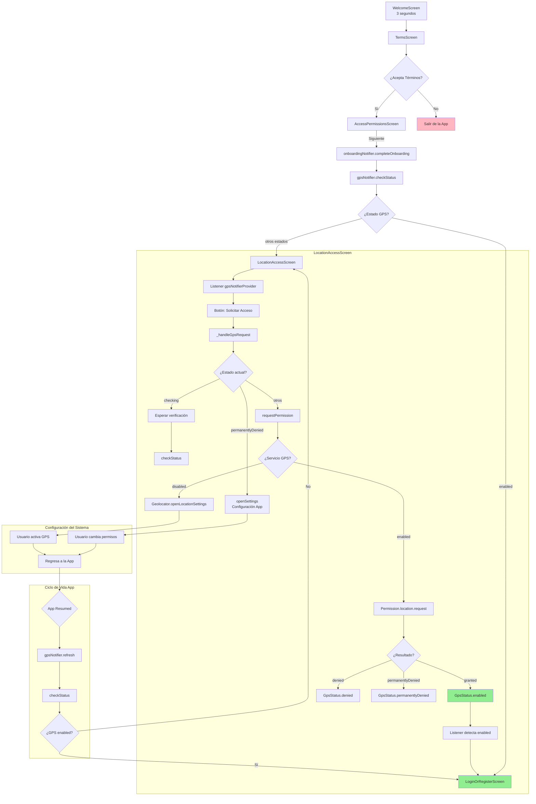

Al abrir la App se deberá verificar que la ubicación del dispositivo (GPS) esté activa, si lo está, la primera vez, se deben solicitar los permisos de acceso a la ubicación, si no lo está se debe mostrar la vista donde se le solicita al usuario el acceso a la ubicación del dispositivo.

Este flujo se ejecuta antes de que el usuario pueda iniciar sesión ya que es necesario se cuente con acceso al GPS al momento de hacer login.

## 1. Inicio del Flujo (Onboarding)

El proceso comienza durante el flujo de bienvenida (onboarding) del usuario, compuesto por tres pantallas secuenciales:

### 1.1 Pantalla de Bienvenida (`welcome_screen.dart`)

-   Muestra el logo y mensaje de bienvenida de Pisto
-   Incluye un indicador de progreso (loading spinner)
-   Después de 3 segundos, redirige automáticamente a la pantalla de términos y condiciones
-   Implementa un timer con manejo seguro del ciclo de vida para evitar navigation leaks

### 1.2 Pantalla de Términos (`terms_screen.dart`)

-   Presenta los términos y condiciones de la aplicación
-   El usuario debe aceptar explícitamente los términos para continuar
-   Una vez aceptados, navega a la pantalla de permisos (`/access-permissions`)

### 1.3 Pantalla de Permisos (`access_permissions_screen.dart`)

Esta pantalla informa al usuario sobre los permisos necesarios y gestiona la lógica de navegación inteligente:

**Permisos mostrados:**

-   Cámara
-   Galería de imágenes
-   Ubicación
-   Mensajes de texto
-   Contactos

**Lógica de navegación al presionar "Siguiente":**

1. Marca el onboarding como completado usando `onboardingNotifier.completeOnboarding()`
2. Verifica el estado actual del GPS usando `gpsNotifier.checkStatus()`
3. Decide la navegación basada en el estado:
    - Si `GpsStatus.enabled`: navega directamente a `LoginOrRegisterScreen`
    - Si cualquier otro estado: navega a `LocationAccessScreen` para solicitar permisos

## 2. Pantalla de Verificación de GPS (`LocationAccessScreen`)

Esta pantalla se encarga específicamente de gestionar los permisos de ubicación y el estado del servicio GPS.

### 2.1 Características Principales

-   **Interfaz simple y clara**: Muestra el logo de Pisto, un mensaje explicativo y un botón de acción
-   **Observación del estado GPS**: Usa un `listener` para escuchar cambios en el `gpsNotifierProvider`
-   **Navegación automática**: Cuando el estado cambia a `GpsStatus.enabled`, redirige automáticamente a `LoginOrRegisterScreen`
-   **Manejo del ciclo de vida**: Implementa `WidgetsBindingObserver` para refrescar el estado cuando la app regresa del background

### 2.2 Lógica de Manejo de Permisos (`_handleGpsRequest`)

La función principal que gestiona las solicitudes de permisos de manera inteligente:

1. **Verificación de estado inicial**: Si el estado es `checking`, espera a que complete la verificación
2. **Manejo de permisos permanentemente denegados**: Si `GpsStatus.permanentlyDenied`, abre directamente la configuración de la app
3. **Solicitud normal**: Para otros casos, solicita el permiso normalmente

## 3. Gestión de Estado (`GpsNotifier`)

El `GpsNotifier` es un Riverpod provider que centraliza toda la lógica relacionada con GPS y permisos de ubicación.

### 3.1 Estados del GPS (`GpsStatus`)

```dart
enum GpsStatus {
  checking,              // Verificando estado actual
  enabled,              // GPS activo y permisos concedidos
  disabled,             // Servicio GPS desactivado en el dispositivo
  denied,               // Permisos denegados por el usuario
  permanentlyDenied,    // Permisos denegados permanentemente
}
```

### 3.2 Métodos Principales

**`checkStatus()`**: Verifica el estado completo del GPS y permisos

-   Primero verifica si el servicio de ubicación está activo (`Geolocator.isLocationServiceEnabled()`)
-   Si está desactivado, establece el estado como `disabled`
-   Si está activo, verifica el estado de los permisos usando `Permission.location.status`
-   Actualiza el estado según el resultado

**`requestPermission()`**: Solicita permisos de manera inteligente

-   Si el servicio GPS está desactivado, intenta abrir la configuración de ubicación
-   Si está activo, solicita formalmente el permiso de ubicación
-   Maneja automáticamente los diferentes estados de respuesta del usuario

**`openSettings()`**: Abre la configuración de la aplicación

-   Utilizado cuando los permisos están permanentemente denegados
-   Después de regresar, verifica automáticamente el nuevo estado

**`refresh()`**: Método público para refrescar el estado

-   Llamado cuando la aplicación regresa del background
-   Asegura que el estado esté actualizado después de cambios externos

### 3.3 Manejo del Ciclo de Vida de la App

En `main.dart`, se implementa `WidgetsBindingObserver` para detectar cambios en el ciclo de vida:

```dart
@override
void didChangeAppLifecycleState(AppLifecycleState state) {
  if (state == AppLifecycleState.resumed) {
    [ref.read](http://ref.read)(gpsNotifierProvider.notifier).refresh();
    // ... otras acciones de refresh
  }
}
```

Este mecanismo asegura que:

-   Cuando el usuario regresa de la configuración del sistema, el estado se actualiza automáticamente
-   Si el usuario activó el GPS externamente, la app detecta el cambio
-   La navegación automática se dispara si las condiciones se cumplen

## 4. Arquitectura de Archivos

La feature GPS está organizada siguiendo las convenciones de Flutter y las mejores prácticas:

```
lib/features/gps/
├── providers/
│   ├── gps_provider.dart      # Lógica principal del estado GPS
│   └── gps_provider.g.dart    # Archivo generado por riverpod_annotation
├── screens/
│   └── gps_access_screen.dart # UI para solicitar permisos de ubicación
└── helpers/
    └── gps_helper.dart        # Utilidades para verificación de GPS
```

### 4.1 GpsHelper

Proporciona métodos utilitarios para verificaciones rápidas de GPS:

-   `checkAndNavigateIfNeeded()`: Verifica GPS y navega si es necesario
-   `isGpsReady()`: Verificación simple del estado del GPS

## 5. Diagrama del Flujo



## 6. Casos de Uso y Escenarios

### 6.1 Escenario Exitoso (Happy Path)

1. Usuario acepta términos y condiciones
2. GPS ya está activado y permisos concedidos
3. Navegación directa a `LoginOrRegisterScreen`

### 6.2 Escenario: Servicio GPS Desactivado

1. Usuario llega a `LocationAccessScreen`
2. Presiona "Solicitar Acceso"
3. Se abre automáticamente la configuración de ubicación del sistema
4. Usuario activa el GPS
5. Al regresar a la app, se detecta automáticamente y navega al login

### 6.3 Escenario: Permisos Denegados

1. Usuario llega a `LocationAccessScreen`
2. Presiona "Solicitar Acceso"
3. Sistema solicita permisos, usuario los deniega
4. Estado cambia a `denied`
5. Usuario puede intentar nuevamente

### 6.4 Escenario: Permisos Permanentemente Denegados

1. Usuario denegó permisos múltiples veces
2. Sistema detecta `permanentlyDenied`
3. Al presionar "Solicitar Acceso", se abre directamente la configuración de la app
4. Usuario debe cambiar permisos manualmente
5. Al regresar, se re-evalúa automáticamente

## 7. Consideraciones Técnicas

### 7.1 Manejo de Estados Asincrónicos

-   Todos los métodos del `GpsNotifier` son async y manejan errores apropiadamente
-   Se verifica `ref.mounted` antes de actualizar estados para evitar memory leaks
-   Los timers y observers se limpian apropiadamente en `dispose()`

### 7.2 Experiencia de Usuario

-   **Navegación automática**: No requiere interacción manual del usuario cuando los permisos se conceden
-   **Feedback claro**: Estados específicos permiten mostrar mensajes apropiados
-   **Manejo inteligente**: Abre automáticamente las configuraciones correctas según el caso

### 7.3 Robustez

-   **Ciclo de vida**: Manejo completo del ciclo de vida de la aplicación
-   **Error handling**: Try-catch en todos los métodos críticos
-   **Estado consistente**: Re-verificación automática cuando la app regresa del background

### 7.4 Dependencias Utilizadas

-   **geolocator**: Para verificar estado del servicio GPS y abrir configuraciones
-   **permission_handler**: Para manejo de permisos de ubicación
-   **riverpod_annotation**: Para generación automática de providers
-   **go_router**: Para navegación declarativa entre pantallas
