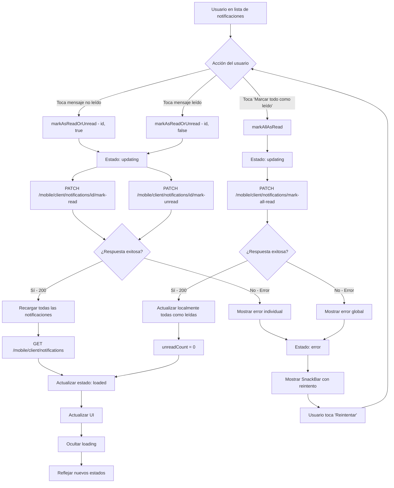

## Descripción General

El flujo de actualización de mensajes leídos permite al usuario gestionar el estado de lectura de sus notificaciones mediante tres acciones principales: marcar mensaje individual como leído, marcar como no leído, y marcar todos los mensajes como leídos. Este flujo complementa la funcionalidad de carga de mensajes y se ejecuta tras interacciones específicas del usuario.

## Funcionalidad Principal

-   **Marcar mensaje individual como leído**: Al tocar un mensaje no leído
-   **Marcar mensaje individual como no leído**: Al tocar un mensaje ya leído
-   **Marcar todos como leídos**: Al presionar botón "Marcar todo como leído (X)"
-   **Actualización automática**: Refresca lista después de cada operación
-   **Feedback visual**: Indicadores de loading durante actualizaciones
-   **Manejo de errores**: Recuperación automática en caso de fallos

## Diagrama de Flujo



## API Endpoints

### 1. Marcar Mensaje Individual como Leído

**PATCH:** `/mobile/client/notifications/{notificationId}/mark-read`

#### Headers Requeridos

-   `Authorization`: `Bearer {access_token}`
-   `Content-Type`: `application/json`

#### Payload

```json
{
    "isRead": true
}
```

#### Respuesta Exitosa (200)

```json
{
    "success": true
}
```

### 2. Marcar Mensaje Individual como No Leído

**PATCH:** `/mobile/client/notifications/{notificationId}/mark-unread`

#### Headers Requeridos

-   `Authorization`: `Bearer {access_token}`
-   `Content-Type`: `application/json`

#### Payload

No se envía payload específico

#### Respuesta Exitosa (200)

```json
{
    "success": true
}
```

### 3. Marcar Todos los Mensajes como Leídos

**PATCH:** `/mobile/client/notifications/mark-all-read`

#### Headers Requeridos

-   `Authorization`: `Bearer {access_token}`
-   `Content-Type`: `application/json`

#### Payload

No se envía payload específico

#### Respuesta Exitosa (200)

```json
{
    "success": true
}
```

### Respuestas de Error Comunes

-   **401 Unauthorized**: Token inválido o expirado
-   **500 Internal Server Error**: Error interno del servidor

## Lógica de Procesamiento

### Flujo de Actualización Individual

1. **Trigger**: Usuario toca un mensaje en la lista
2. **Detección de estado**: Verificar si mensaje es `isRead` o `isUnread`
3. **Llamada condicional**:
    - Si no leído → `markAsReadOrUnread(id, true)`
    - Si leído → `markAsReadOrUnread(id, false)`
4. **Estado de loading**: `status = updating`, `lastUpdatedNotificationId = id`
5. **Llamada API**: Endpoint correspondiente según acción
6. **Post-procesamiento**: Recargar todas las notificaciones desde API
7. **Actualización final**: Nuevo estado `loaded` con datos actualizados

### Flujo de Actualización Masiva

1. **Trigger**: Usuario presiona "Marcar todo como leído (X)"
2. **Validación**: Solo ejecutar si `unreadCount > 0`
3. **Estado de loading**: `status = updating`
4. **Llamada API**: `PATCH /mobile/client/notifications/mark-all-read`
5. **Actualización local**: Marcar todas las notificaciones localmente como leídas
6. **Optimización**: No requiere recarga desde API
7. **Estado final**: `unreadCount = 0`, estado `loaded`

### Manejo de Estados de Loading

-   **Individual**: Muestra `CircularProgressIndicator` en la notificación específica
-   **Masivo**: Cambia botón a estado "Actualizando..." con indicador
-   **Identificación**: Usa `lastUpdatedNotificationId` para identificar elemento en proceso

## Comportamiento de UI

### Estados Visuales Durante Actualización

-   **Mensaje individual**: Reemplaza icono de check por spinner
-   **Botón masivo**: Cambia texto y color, muestra loading
-   **Interactividad**: Deshabilita acciones durante procesamiento

### Diferenciación de Estados Post-Actualización

-   **Mensaje leído**:
    -   Fondo: Blanco
    -   Texto: Peso normal
    -   Icono: `Icons.check_circle` (verde)
-   **Mensaje no leído**:
    -   Fondo: Azul claro
    -   Texto: Negrita
    -   Icono: `Icons.check_circle_outline` (gris)

### Actualización de Contadores

-   **Cálculo automático**: `unreadNotifications.length`
-   **Botón visibility**: Solo visible si `unreadCount > 0`
-   **Texto dinámico**: "Marcar todo como leído (X)" donde X es conteo actual

## Manejo de Errores

### Tipos de Error por Operación

-   **Mensaje individual**: Error específico del mensaje
-   **Operación masiva**: Error que afecta toda la lista
-   **Errores de red**: Timeout, conectividad
-   **Errores de autorización**: Token expirado

### Estrategias de Recuperación

-   **SnackBar con reintento**: Botón para repetir operación fallida
-   **Mantener estado anterior**: No altera datos locales si API falla
-   **Clear error**: Método `clearError()` para limpiar mensajes de error
-   **Reintento inteligente**: Distingue entre errores temporales y permanentes

### Mensajes de Error

-   **Individual**: "Error al actualizar notificación"
-   **Masivo**: "Error al marcar todas como leídas"
-   **Red**: Mensaje específico del NetworkException
-   **Genérico**: "Error inesperado al..." con descripción

## Integración con Arquitectura

### Estados de NotificationsNotifier

-   `NotificationsStatus.updating`: Durante cualquier operación de actualización
-   `NotificationsStatus.loaded`: Después de operación exitosa
-   `NotificationsStatus.error`: En caso de fallos

### Coordinación con UI

-   **Listener**: `NotificationsScreen` escucha cambios de estado
-   **Error handling**: Automático mediante `ref.listen()`
-   **Loading states**: Reflejados instantáneamente en UI

### Optimizaciones de Performance

-   **Actualización local**: Para operación "marcar todas" evita llamada GET adicional
-   **Identificación granular**: `lastUpdatedNotificationId` permite UI específica
-   **Estado persistente**: Mantiene datos entre navegación con `keepAlive: true`

## Casos de Uso Específicos

### Caso 1: Usuario marca mensaje individual como leído

1. Usuario toca mensaje con `readAt: null`
2. UI muestra loading en ese mensaje específico
3. API actualiza `readAt` con timestamp actual
4. Se recarga lista completa desde API
5. UI refleja cambio visual y reduce contador

### Caso 2: Usuario marca mensaje como no leído

1. Usuario toca mensaje con `readAt: {timestamp}`
2. API elimina timestamp de `readAt` (null)
3. Recarga y actualización de UI
4. Incrementa contador de no leídos

### Caso 3: Usuario marca todos como leídos

1. Usuario presiona botón con conteo "Marcar todo como leído (5)"
2. Botón cambia a "Actualizando..." con loading
3. API actualiza todos los mensajes del usuario
4. Actualización local sin recarga API
5. Contador se resetea a 0, botón desaparece

## Archivos de Implementación

-   **Provider**: `lib/features/notifications/providers/notifications_provider.dart:129` - `markAsReadOrUnread()`
-   **Provider**: `lib/features/notifications/providers/notifications_provider.dart:163` - `markAllAsRead()`
-   **Repository**: `lib/features/notifications/repositories/notifications_repository.dart:57` - `markAllNotificationsAsRead()`
-   **Repository**: `lib/features/notifications/repositories/notifications_repository.dart:94` - `markNotificationAsReadOrUnread()`
-   **UI Screen**: `lib/features/notifications/screens/notifications_screen.dart:166` - `_handleNotificationTap()`
-   **UI Button**: `lib/features/notifications/screens/notifications_screen.dart:109` - Botón "Marcar todo como leído"
