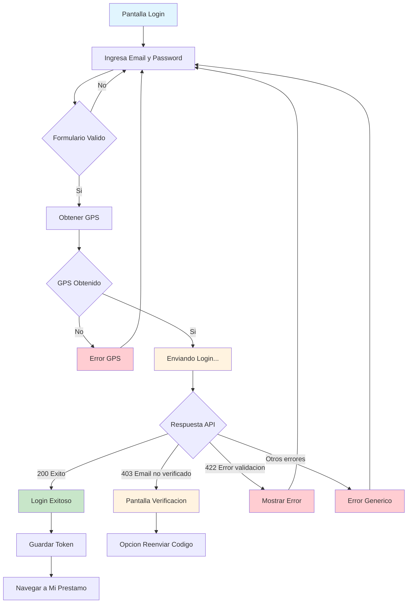
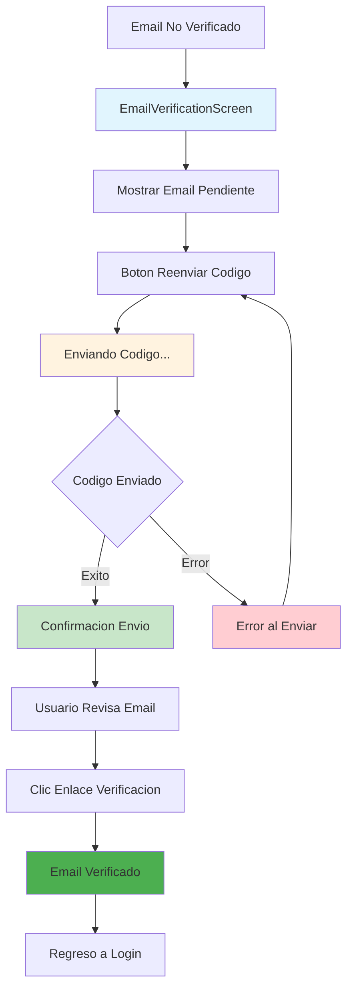

## Descripción General

El flujo de autenticación permite a los usuarios registrados acceder a la aplicación mediante su email y contraseña. El sistema incluye captura automática de geolocalización, manejo de verificación de email, y preparación para acceso biométrico futuro. Está implementado siguiendo la arquitectura feature-based con Riverpod para gestión de estado.

## Arquitectura de la Implementación

### Estructura de Archivos

```
lib/features/auth/
├── screens/
│   └── login_screen.dart                   # UI principal del login
├── providers/
│   ├── auth_provider.dart                  # Gestión de estado de autenticación
│   └── login_form_provider.dart            # Gestión de estado del formulario
├── models/
│   ├── login_request.dart                  # DTO para la petición
│   └── login_response.dart                 # DTO para las respuestas
├── repositories/
│   └── auth_repository.dart                # Capa de datos y API
└── entities/
    └── user_entity.dart                    # Entidad de dominio del usuario
```

## Flujo de Usuario (UX)

### 1. Pantalla de Login

**Pantalla:** `LoginScreen`

**Elementos UI:**

-   Header con logo de Pisto y mensaje "Bienvenido / Ingresa a tu cuenta"
-   Campo email con validación en tiempo real
-   Campo contraseña con botón mostrar/ocultar
-   Enlace "¿Olvidaste tu contraseña?"
-   Botón principal "Siguiente"
-   Enlace "¿No tienes cuenta? Regístrate"

### 2. Estados de Autenticación

-   `unauthenticated`: Usuario no autenticado
-   `loading`: Procesando autenticación
-   `authenticated`: Usuario autenticado exitosamente
-   `withOutEmailVerification`: Email no verificado (código 403)
-   `error`: Error en la autenticación

### 3. Flujo Post-Autenticación

**En caso exitoso:**

-   Almacena token de acceso
-   Verifica versión de app
-   Inicializa notificaciones
-   Evalúa si debe cargar contactos (`loadContacts`)
-   Navega a vista "Mi préstamo"

## Diagrama de Flujo



## Si el email no está verificado



## Implementación Técnica

### 1. Gestión de Estado (`AuthNotifier`)

**Estados principales (`AuthState`):**

```dart
@freezed
abstract class AuthState with _$AuthState {
  const factory AuthState({
    @Default(AuthStatus.unauthenticated) AuthStatus status,
    @Default(null) String? token,
    @Default(null) UserEntity? user,
    @Default(false) bool isLoading,
    @Default(null) String? errorMessage,
    @Default(false) bool needsToLoadContacts,
    @Default(null) String? pendingVerificationEmail,
    @Default(false) bool emailResent,
  }) = _AuthState;
}
```

**Método principal de login:**

```dart
Future<void> login(String email, String password) async {
  // 1. Activar estado de carga
  // 2. Obtener ubicación GPS
  // 3. Enviar petición de login
  // 4. Manejar respuesta y excepciones
  // 5. Actualizar estado según resultado
}
```

### 2. Validación del Formulario (`LoginFormNotifier`)

**Estado del formulario:**

```dart
@freezed
abstract class LoginFormState with _$LoginFormState {
  const factory LoginFormState({
    @Default(EmailInput.pure()) EmailInput email,
    @Default(PasswordInput.pure()) PasswordInput password,
    @Default(false) bool showPassword,
    @Default(FormzSubmissionStatus.initial) FormzSubmissionStatus status,
  }) = _LoginFormState;
}
```

### 3. Capa de Datos (`AuthRepository`)

**Endpoint:** `POST /mobile/login`

**Request Model:**

```dart
@freezed
abstract class LoginRequest with _$LoginRequest {
  const factory LoginRequest({
    required String email,
    required String password,
    required String lat,
    required String long,
    required String address,
  }) = _LoginRequest;
}
```

**Response Model:**

```dart
class LoginResponse {
  final String accessToken;
  final String tokenType;
  final int? expiresIn;
  final bool loadContacts;
  final User user;
}
```

### 4. Integración con Geolocalización

El sistema requiere ubicación GPS obligatoriamente:

-   Utiliza `LocationNotifier` para obtener coordenadas
-   Captura latitud, longitud y dirección
-   Si falla la ubicación, no permite continuar con el login
-   Los datos se envían en cada petición de autenticación

## Contratos API

### Request

```json
POST /mobile/login
Content-Type: application/json
Accept: application/json
Language: "es"

{
  "email": "user@mail.example",
  "password": "Passw0rd#",
  "lat": "13.689445985633",
  "long": "-89.187285796235",
  "address": "Dirección física del usuario"
}
```

### Response Exitosa (200)

```json
{
    "data": {
        "accessToken": "10|YRrrSx8nGhQsqpGZESPy86gNDwZ9vhc9kvz6OKmy",
        "tokenType": "bearer",
        "expiresIn": 120,
        "loadContacts": true,
        "user": {
            "id": 123,
            "email": "user@mail.example",
            "appVersion": "1.0.0",
            "profile": {
                /* datos del perfil */
            },
            "job": {
                /* datos laborales */
            }
        }
    }
}
```

### Response Email No Verificado (403)

```json
{
    "errors": [
        {
            "code": "Verificación de correo electrónico inválida.",
            "message": "Usuario no autorizado para esta funcionalidad"
        }
    ]
}
```

### Response Error de Validación (422)

```json
{
    "errors": [
        {
            "code": "Specific API Error",
            "message": "La combinación de usuario y contraseña no coinciden"
        },
        {
            "code": "Specific API Error",
            "message": "El campo correo electrónico es obligatorio"
        },
        {
            "code": "Specific API Error",
            "message": "El campo contraseña es obligatorio"
        },
        {
            "code": "Specific API Error",
            "message": "El campo correo electrónico no tiene un formato válido"
        }
    ]
}
```

### Validaciones Backend

```json
{
    "email": {
        "rules": ["required", "email"]
    },
    "password": {
        "rules": ["required", "min:8", "max:20"],
        "note": "Debe tener una mayúscula, una minúscula, un número y un carácter especial"
    }
}
```

## Funcionalidades Especiales

### 1. Parámetro `loadContacts`

El backend determina si la app debe cargar contactos basado en:

-   Si no existen contactos del usuario: `loadContacts = true`
-   Si los contactos tienen más de 3 meses: `loadContacts = true`
-   Si los contactos tienen menos de 3 meses: `loadContacts = false`

### 2. Captura de Geolocalización

**Backend:** Guarda datos en tabla `user_app_locations`:

-   `lat`: Latitud del usuario
-   `long`: Longitud del usuario
-   `address`: Dirección física (obtenida mediante geocoding)

### 3. Acceso Biométrico (Implementación Futura)

**Estados de configuración:**

-   `biometric = 1`: Inactivo (pregunta cada login)
-   `biometric = 2`: Activo (credenciales guardadas)
-   `biometric = 3`: Inactivo (usuario rechazó permanentemente)

**Flujo propuesto:**

-   Después del primer login exitoso
-   Si el dispositivo soporta biometría
-   Mostrar diálogo: "¿Desea activar el acceso biométrico a Pisto?"
    -   Sí
    -   No por ahora
    -   No, no volver a preguntar

## Manejo de Errores

### Excepciones Específicas

-   `EmailNotVerifiedException`: Email no verificado (403)
-   `AuthException`: Errores de autenticación general
-   `NetworkException`: Errores de conectividad

### Estados de Error

-   Errores de validación: Se muestran bajo los campos
-   Errores de red: SnackBar con mensaje específico
-   Email no verificado: Navegación a pantalla de verificación

## Integración con la Arquitectura

### Estado Global

-   Integrado con `AppStateNotifier` para flujo de navegación
-   Coordina con `LocationNotifier` para GPS
-   Se comunica con `NotificationsNotifier` para FCM
-   Maneja `AppVersionNotifier` para actualizaciones

### Almacenamiento Seguro

-   Token de acceso guardado en `TokenStorageService`
-   Limpieza automática de tokens en caso de error
-   Validación automática de token al iniciar la app

### Navegación

-   Ruta definida: `/login`
-   Navegación automática post-login según estado del usuario
-   Redirección a verificación de email si es necesario
