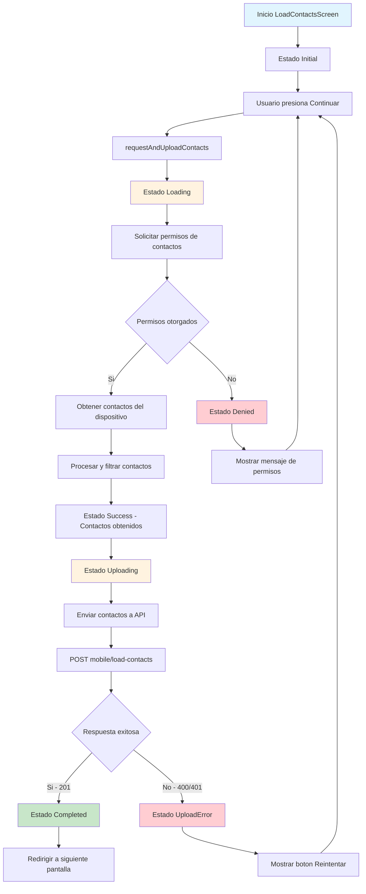

## Descripción General

El flujo de carga de contactos permite a la aplicación acceder y enviar a la API todos los contactos registrados en la agenda del usuario. Esta funcionalidad se activa únicamente cuando la llave `loadContacts` recibida en el flujo de autenticación tiene valor `true`.

## Funcionalidad Principal

-   **Acceso a contactos**: Solicita permisos para acceder a la agenda del dispositivo
-   **Extracción de datos**: Obtiene nombre, teléfonos y email de cada contacto
-   **Envío a API**: Transmite los contactos al backend para su almacenamiento
-   **Sincronización**: Actualiza o crea registros en la tabla `user_app_contacts`

## Diagrama de Flujo



## Estados del Flujo

### UserContactsStatus

| Estado              | Descripción                                                 |
| ------------------- | ----------------------------------------------------------- |
| `initial`           | Estado inicial antes de solicitar permisos                  |
| `loading`           | Solicitando permisos y obteniendo contactos del dispositivo |
| `uploading`         | Enviando contactos a la API                                 |
| `success`           | Contactos obtenidos exitosamente del dispositivo            |
| `completed`         | Todo el proceso completado (contactos enviados a API)       |
| `uploadError`       | Error al enviar contactos a la API                          |
| `denied`            | Permisos de contactos denegados                             |
| `deniedPermanently` | Permisos denegados permanentemente                          |

## Estructura de Datos

### UserContactEntity

```dart
class UserContactEntity {
  final String name;        // Nombre completo del contacto (requerido)
  final String? phone1;     // Teléfono principal (opcional)
  final String? phone2;     // Teléfono secundario (opcional)
  final String? email;      // Correo electrónico (opcional)
}
```

### Payload de Envío

```json
{
    "data": {
        "contacts": [
            {
                "name": "Pedro Martínez",
                "phone1": "46463184611",
                "phone2": null,
                "email": null
            }
        ]
    }
}
```

## API Endpoint

**POST:** `/mobile/load-contacts`

### Headers Requeridos

-   `content-type`: `application/json`
-   `accept`: `application/json`
-   `Authorization`: `Bearer {token}`
-   `Language`: `es`

### Respuestas

#### Éxito (201)

```json
{
    "data": {
        "contacts": "ok"
    }
}
```

#### Error (400/401)

```json
{
    "errors": [
        {
            "code": "Specific API Error",
            "message": "Se ha producido un error, intente nuevamente"
        }
    ]
}
```

## Lógica de Procesamiento

### En el Dispositivo

1. **Solicitud de permisos**: Uso de `FlutterContacts.requestPermission()`
2. **Obtención de contactos**: `FlutterContacts.getContacts(withProperties: true)`
3. **Filtrado**: Solo contactos con nombre no vacío
4. **Mapeo**: Conversión de `Contact` de Flutter a `UserContactEntity`

### En el Backend

1. **Identificación del usuario**: Por token de autorización
2. **Limpieza de datos**: Si existen contactos previos, se eliminan
3. **Almacenamiento**: Inserción en tabla `user_app_contacts`
4. **Respuesta**: Confirmación de procesamiento exitoso

## Manejo de Errores

### Tipos de Excepción

-   `UserContactsExceptionType.network`: Errores de conectividad
-   `UserContactsExceptionType.validation`: Errores de validación de datos
-   `UserContactsExceptionType.unauthorized`: Token inválido o expirado
-   `UserContactsExceptionType.unknown`: Errores inesperados

### Estrategia de Reintento

-   En caso de error de envío, se mantienen los contactos obtenidos
-   El usuario puede reintentar el envío presionando "Reintentar"
-   Los permisos denegados requieren intervención manual del usuario

## Integración con Arquitectura Global

### Coordinación con AppStateNotifier

-   El estado `contactsStatus` refleja el progreso del flujo
-   La navegación se controla mediante `RouteMiddleware`
-   Solo se permite continuar cuando `contactsStatus == completed`

### Seguridad y Privacidad

-   Los contactos se procesan localmente antes del envío
-   Se requiere autenticación válida para el envío
-   El backend identifica al usuario por token JWT
-   Los datos se almacenan asociados al `user_id` específico

## Archivos Principales

-   **Provider**: `lib/features/user_contacts/providers/user_contacts_provider.dart:75`
-   **Repository**: `lib/features/user_contacts/repositories/user_contacts_repository.dart:20`
-   **Screen**: `lib/features/user_contacts/screens/load_contacts_screen.dart:17`
-   **Entity**: `lib/features/user_contacts/entities/user_contact_entity.dart:14`
