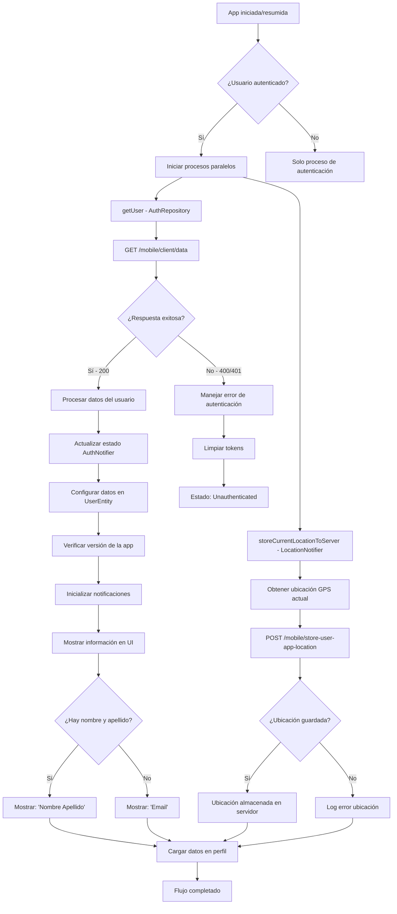

## Descripción General

El flujo de carga de información del cliente obtiene y muestra los datos personales, de perfil y laborales del usuario autenticado. Esta información se utiliza para mostrar el nombre/email en la parte superior de todas las vistas y para cargar los datos en la vista "Configuración de perfil".

## Funcionalidad Principal

-   **Obtención automática**: Se activa automáticamente tras la autenticación exitosa
-   **Datos personales**: Carga nombre, apellido, email, status y loan_status
-   **Información de perfil**: Obtiene datos personales y de configuración
-   **Datos laborales**: Carga información del trabajo del usuario
-   **Almacenamiento de ubicación**: Guarda ubicación GPS del usuario al iniciar/resumir app
-   **Procesamiento paralelo**: Ejecuta carga de datos y almacenamiento de ubicación simultáneamente

## Diagrama de Flujo



## Estructura de Datos

### UserEntity (Cliente)

```dart
class UserEntity {
  final String appVersion;
  final int id;
  final String? name;           // Opcional - nombre del usuario
  final String? surname;        // Opcional - apellido del usuario
  final String email;           // Siempre disponible
  final bool isAdmin;
  final int status;             // Estado del usuario
  final int loanStatus;         // Estado del préstamo
  final bool? needBiometricAuth;
  final bool? needFCMToken;
  final UserProfileEntity profile;
  final UserJobEntity job;
}
```

### UserProfileEntity (Perfil)

```dart
class UserProfileEntity {
  final bool emailNotifications;
  final bool smsNotifications;
  final String? dui;           // Número de identificación
  final String? gender;
  final DateTime? birthDate;
  final String? phoneNumber;
  final String? street;
  final String? streetNumber;
  final String? municipality;
  final String? suburb;
  final String? department;
  final String? avatar;        // URL del avatar
}
```

### UserJobEntity (Trabajo)

```dart
class UserJobEntity {
  final String? jobType;
  final String? companyName;
  final String? companyPhone;
  final String? netIncome;
  final String? additionalIncome;
  final String? otherLoan;
}
```

### LocationData (Ubicación)

```dart
class LocationData {
  final String long;        // Longitud GPS
  final String lat;         // Latitud GPS
  final String address;     // Dirección completa
}
```

## API Endpoints

### Carga de Datos del Cliente

**GET:** `/mobile/client/data`

### Headers Requeridos

-   `content-type`: `application/json`
-   `accept`: `application/json`
-   `Authorization`: `Bearer {token}`
-   `Language`: `es`

### Respuesta Exitosa (200)

```json
{
    "data": {
        "appVersion": "1.2",
        "id": 20,
        "name": "Pedro",
        "surname": "Martínez",
        "email": "prueba@prueba.com",
        "isAdmin": false,
        "status": 2,
        "loanStatus": 4,
        "needBiometricAuth": true,
        "biometricId": null,
        "needFCMToken": true,
        "profile": {
            "emailNotifications": true,
            "smsNotifications": true,
            "idNumber": "454546567-9",
            "gender": "masculino",
            "birthDate": "1980-05-18",
            "phoneNumber": "+5487456823231",
            "street": "Melancolía",
            "streetNumber": 7,
            "municipality": "San Bernardo",
            "suburb": "Cualquiera",
            "department": "Cualquiera",
            "avatar": "https://servicioalmacenamiento/carpeta/imagen.png"
        },
        "job": {
            "jobType": "Empleado",
            "companyName": "Industrias La Alegría",
            "companyPhone": "+546754546567",
            "netIncome": 453.25,
            "additionalIncome": 125.0,
            "otherLoan": 0.0
        }
    }
}
```

### Respuesta de Error (400/401)

```json
{
    "errors": [
        {
            "code": "Specific API Error",
            "message": "Usuario no autenticado"
        }
    ]
}
```

## Almacenamiento de Ubicación

Esta funcionalidad se activará cada vez que se levante la aplicación en el dispositivo del usuario, junto con la carga de información del cliente.

Se enviarán al endpoint establecido los datos de geolocalización y éstos serán guardados en la tabla `user_app_locations` tal como se hace cuando el usuario procesa la autenticación.

**POST:** `/mobile/store-user-app-location`

#### Headers Requeridos

-   `content-type`: `application/json`
-   `accept`: `application/json`
-   `Authorization`: `Bearer {token}`
-   `Language`: `es`

#### Payload (200)

```json
{
    "long": "-89.2182",
    "lat": "13.6929",
    "address": "San Salvador, El Salvador"
}
```

#### Respuesta Exitosa

-   **Code**: 200-299
-   **Content**: Sin respuesta específica (éxito implícito)

#### Respuesta de Error

```json
{
    "errors": [
        {
            "message": "Error message"
        }
    ]
}
```

## Estados de Autenticación

### AuthStatus

| Estado                     | Descripción                                 |
| -------------------------- | ------------------------------------------- |
| `loading`                  | Verificando estado inicial de autenticación |
| `authenticated`            | Usuario autenticado con datos cargados      |
| `unauthenticated`          | Usuario sin autenticar                      |
| `error`                    | Error al cargar datos del usuario           |
| `withOutEmailVerification` | Email no verificado                         |

## Lógica de Procesamiento

### Flujo Automático Post-Autenticación

1. **Verificación inicial**: `_checkInitialAuthState()` al inicializar
2. **Validación de token**: Verificar token almacenado
3. **Procesos paralelos**: Ejecutar simultáneamente:
    - `getUser()` para obtener datos actualizados
    - `storeCurrentLocationToServer()` para guardar ubicación GPS
4. **Procesamiento**: `_setAuthenticatedState()` con datos recibidos

### Actualización de Datos

1. **Conversión de modelos**: De `LoginResponse.User` a `UserEntity`
2. **Verificación de versión**: Comparar versión de app
3. **Inicialización automática**: Configurar notificaciones
4. **Estado de contactos**: Determinar si necesita cargar contactos

### Procesamiento de Ubicación

1. **Obtención GPS**: Usar `Geolocator` para coordenadas actuales
2. **Geocodificación**: Convertir coordenadas a dirección legible
3. **Envío a servidor**: POST a `/mobile/store-user-app-location`
4. **Almacenamiento**: Guardar en tabla `user_app_locations`

## Visualización en UI

### Lógica de Nombre de Usuario

```dart
extension UserEntityExtension on UserEntity {
  String get fullName => '${name ?? ''} ${surname ?? ''}';
}
```

-   **Con nombre y apellido**: Muestra "Pedro Martínez"
-   **Sin nombre/apellido**: Muestra el email
-   **Avatar**: URL desde `profile.avatar` o imagen genérica si es `null`

## Integración con Arquitectura Global

### Coordinación con Otros Servicios

-   **AppVersionNotifier**: Verifica versión usando `user.appVersion`
-   **NotificationsNotifier**: Se inicializa automáticamente
-   **LocationNotifier**: Procesa y almacena ubicación GPS automáticamente
-   **RouteMiddleware**: Usa estado de auth para navegación
-   **App Lifecycle**: Integrado con `didChangeAppLifecycleState` para ejecutar en resume

### Persistencia de Datos

-   **Token**: Almacenado en `TokenStorageService`
-   **Estado global**: Mantenido en `AuthNotifier` con Riverpod
-   **Datos de perfil**: Disponibles para otras funcionalidades
-   **Ubicaciones**: Almacenadas en tabla `user_app_locations` del servidor

### Trigger de Ejecución

-   **Al inicializar la app**: `_checkInitialAuthState()` verifica token y carga datos
-   **Al resumir la app**: `didChangeAppLifecycleState(AppLifecycleState.resumed)`
-   **Solo usuarios autenticados**: Verifica `authStatus == AuthStatus.authenticated`
-   **Procesos paralelos**: `getUser()` y `storeCurrentLocationToServer()` simultáneos

## Manejo de Errores

### Tipos de Error

-   **Token inválido/expirado**: Limpia tokens y desautentica
-   **Error de red**: Muestra mensaje de error manteniendo estado
-   **Datos incompletos**: Maneja campos opcionales como `null`
-   **Error de ubicación**: No bloquea el flujo, solo registra error en logs
-   **Permisos GPS denegados**: Retorna `false` sin interrumpir otras funciones

### Recuperación de Errores

-   **Reintento automático**: En inicialización de app
-   **Limpieza de estado**: Tokens inválidos eliminados automáticamente
-   **Fallback**: Email mostrado si no hay nombre/apellido

## Características Especiales

### Gestión de Avatar

-   **URL dinámica**: Desde backend en `profile.avatar`
-   **Imagen genérica**: Fallback local si avatar es `null`
-   **Actualización**: Se actualiza con cada carga de datos

### Token FCM

-   **Indicador**: `needFCMToken` determina si solicitar token Firebase
-   **Notificaciones**: Se inicializan automáticamente tras autenticación

## Archivos Principales

### Autenticación y Datos de Usuario

-   **Provider**: `lib/features/auth/providers/auth_provider.dart:179`
-   **Repository**: `lib/features/auth/repositories/auth_repository.dart:102`
-   **Entity**: `lib/features/auth/entities/user_entity.dart:8`
-   **Response Model**: `lib/features/auth/models/login_response.dart:44`

### Ubicación GPS

-   **Provider**: `lib/core/providers/location_provider.dart:108`
-   **Service**: `lib/core/services/location_service.dart:62`
-   **App Lifecycle**: `lib/main.dart:58`
