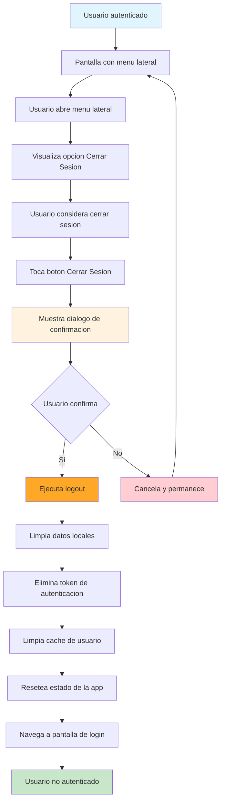

## Descripción General

El flujo de logout permite a los usuarios cerrar sesión en el sistema de forma segura. Se puede acceder desde el menú lateral desplegable o mediante el botón de salida del sistema operativo. Incluye un modal de confirmación antes de proceder con el cierre de sesión para evitar logout accidental. Está integrado completamente con el sistema de autenticación y la gestión de tokens.

## Arquitectura de la Implementación

### Estructura de Archivos

```
lib/features/auth/
├── providers/
│   └── auth_provider.dart                     # Gestión de estado de logout
└── repositories/
    └── auth_repository.dart                   # Capa de datos para logout API

lib/shared/widgets/layouts/
└── app_sidebar_layout.dart                    # UI del menú lateral con botón logout
```

## Flujo de Usuario (UX)

### 1. Puntos de Acceso al Logout

-   **Menú lateral:** Botón "Cerrar Sesión" en el drawer/sidebar de la app
-   **Botón de salida del sistema:** Cuando el usuario presiona el botón de back/exit del dispositivo

### 2. Modal de Confirmación

**Antes de proceder con el logout:**

-   Título: "Cerrar Sesión"
-   Mensaje: "¿Estás seguro que deseas cerrar sesión?"
-   Botón "Cancelar" (secundario)
-   Botón "Cerrar Sesión" (primario)

### 3. Proceso de Logout

**Una vez confirmado:**

-   Envía petición al backend para invalidar el token
-   Limpia tokens del almacenamiento local
-   Actualiza estado de autenticación a `unauthenticated`
-   Muestra mensaje de confirmación: "Sesión cerrada exitosamente"
-   Redirige automáticamente a la pantalla de login

## Diagrama de Flujo



## Implementación Técnica

### 1. Gestión de Estado (`AuthNotifier`)

**Método principal de logout:**

```dart
Future<void> logout() async {
  try {
    // 1. Llamar al endpoint de logout del backend
    await _authRepository.logout();

    // 2. Limpiar tokens del almacenamiento local
    await TokenStorageService.clearTokens();

    // 3. Actualizar estado a no autenticado
    state = const AuthState(status: AuthStatus.unauthenticated);
  } catch (e) {
    // Aún si falla el API, limpiar estado local
    state = state.copyWith(
      status: AuthStatus.error,
      errorMessage: e.toString(),
    );
  }
}
```

**Características del método:**

-   Siempre limpia el estado local, incluso si el API falla
-   No bloquea el logout por errores de red
-   Actualiza el estado de autenticación inmediatamente

### 2. Capa de Datos (`AuthRepository`)

**Endpoint:** `POST /logout`

**Método de logout:**

```dart
Future<int?> logout() async {
  try {
    final response = await _httpClient.post('/logout');
    return response.statusCode;
  } on DioException catch (e) {
    // Manejo de errores de red
    final networkError = NetworkException.fromDioError(e);
    throw AuthException(
      message: networkError.message,
      statusCode: networkError.statusCode,
      type: AuthExceptionType.network,
      data: networkError.data,
    );
  } catch (e) {
    throw AuthException(
      message: 'Error inesperado al cerrar sesión: ${e.toString()}',
      type: AuthExceptionType.unknown,
    );
  }
}
```

### 3. UI del Modal de Confirmación (`AppSidebarLayout`)

**Método de manejo del logout:**

```dart
void _handleLogout(BuildContext context, Future<void> Function() onLogout) {
  // 1. Cerrar drawer primero
  Navigator.pop(context);

  // 2. Mostrar modal de confirmación
  showDialog(
    context: context,
    builder: (BuildContext context) {
      return AlertDialog(
        title: const Text('Cerrar Sesión'),
        content: const Text('¿Estás seguro que deseas cerrar sesión?'),
        actions: [
          TextButton(
            onPressed: () => Navigator.of(context).pop(),
            child: const Text('Cancelar'),
          ),
          TextButton(
            onPressed: () {
              Navigator.of(context).pop();
              onLogout();
              ScaffoldMessenger.of(context).showSnackBar(
                const SnackBar(content: Text('Sesión cerrada exitosamente')),
              );
            },
            child: const Text('Cerrar Sesión'),
          ),
        ],
      );
    },
  );
}
```

## Contratos API

### Request

```json
POST /logout
Authorization: "Bearer 10|YRrrSx8nGhQsqpGZESPy86gNDwZ9vhc9kvz6OKmy"
Content-Type: application/json
Accept: application/json
Language: "es"

// Sin payload - solo headers de autenticación
```

### Response Exitosa (204)

```json
// Sin contenido - respuesta vacía
// Código 204 indica éxito sin contenido
```

### Response Error General (400)

```json
{
    "errors": [
        {
            "code": "Specific API Error",
            "message": "Se ha producido un error, intente nuevamente"
        }
    ]
}
```

### Response No Autorizado (401)

```json
{
    "errors": [
        {
            "code": "Specific API Error",
            "message": "Usuario no autenticado"
        }
    ]
}
```

## Manejo de Errores

### Estrategia de Logout Resiliente

-   **Prioridad 1**: Limpiar estado local siempre
-   **Prioridad 2**: Notificar al backend (best effort)
-   **Filosofía**: "Logout local nunca debe fallar"

### Códigos de Error del API

-   **204**: Éxito - Token invalidado en el servidor
-   **400**: Error general del servidor
-   **401**: Token ya inválido o no enviado
-   **Red/Timeout**: Errores de conectividad

### Estados de Error en UI

-   Los errores de logout no bloquean el proceso
-   Se muestra mensaje de éxito independientemente del resultado del API
-   El usuario siempre regresa a la pantalla de login

## UI y Componentes

### 1. Botón de Logout en el Sidebar

**Diseño:**

-   Ubicado al final del menú lateral
-   Estilo distintivo con fondo rojo semi-transparente
-   Ícono de logout + texto "Cerrar Sesión"
-   Borde rojo para mayor visibilidad

### 2. Modal de Confirmación

**Elementos:**

-   `AlertDialog` nativo de Flutter
-   Título claro: "Cerrar Sesión"
-   Pregunta de confirmación simple
-   Dos botones: "Cancelar" y "Cerrar Sesión"

### 3. Feedback Visual

-   SnackBar con mensaje de éxito
-   Navegación automática a login después del logout
-   Animaciones suaves de transición

## Integración con la Arquitectura

### Estado Global

-   Integrado completamente con `AuthNotifier`
-   Se conecta con el sistema de navegación via GoRouter
-   Limpieza automática de todos los datos de sesión

### Almacenamiento de Tokens

-   Utiliza `TokenStorageService` para limpiar tokens
-   Limpieza segura de access tokens y refresh tokens
-   No deja rastros de datos sensibles

### Navegación

-   Redirección automática controlada por route middleware
-   Estado de autenticación sincronizado con navegación
-   No requiere navegación manual desde el componente de logout

## Consideraciones de UX

### 1. Confirmación Obligatoria

-   Evita logout accidental con modal de confirmación
-   Texto claro y directo sobre la acción
-   Botones bien diferenciados visualmente

### 2. Feedback Inmediato

-   Modal se cierra inmediatamente al confirmar
-   SnackBar aparece instantáneamente
-   Transición suave a la pantalla de login

### 3. Manejo del Botón de Sistema

-   Intercepta el botón back/exit del dispositivo
-   Mismo flujo de confirmación que el botón del menú
-   Experiencia consistente en ambos casos

## Consideraciones de Seguridad

### 1. Invalidación de Tokens

-   El backend invalida el token en la base de datos
-   Previene uso posterior del token después del logout
-   Tokens de refresh también se invalidan

### 2. Limpieza Local Completa

-   Todos los tokens se eliminan del almacenamiento local
-   Datos sensibles se limpian de la memoria
-   Estado de autenticación se resetea completamente

### 3. Manejo de Errores Seguro

-   Logout local exitoso incluso si falla el backend
-   No expone información sensible en mensajes de error
-   Comportamiento consistente independiente del estado del servidor
