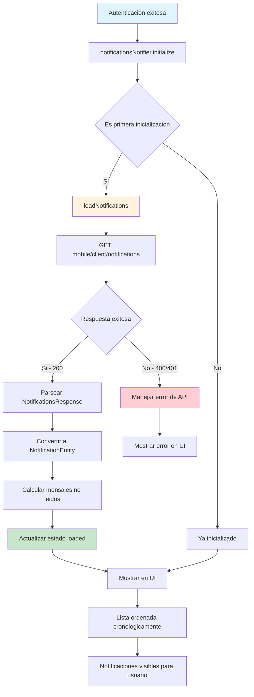

## Descripción General

El flujo de carga de mensajes del cliente obtiene y muestra las notificaciones/mensajes del usuario autenticado. Esta funcionalidad se activa automáticamente tras la autenticación exitosa y se muestra mediante un botón en la parte superior de todas las vistas de usuario.

## Funcionalidad Principal

-   **Carga automática**: Se inicializa automáticamente después de la autenticación exitosa
-   **Visualización de mensajes**: Muestra notificaciones con colores, fechas y estado de lectura
-   **Ordenamiento cronológico**: Muestra mensajes en orden descendente (más recientes primero)
-   **Conteo de no leídos**: Muestra cantidad de mensajes pendientes de leer

## Diagrama de Flujo



## Estructura de Datos

### NotificationEntity

```dart
class NotificationEntity {
  final String id;               // messageId de la API
  final String message;          // Contenido del mensaje
  final Color statusColor;       // Color del círculo (red, green, yellow)
  final DateTime createdAt;      // Fecha de creación
  final DateTime? readAt;        // Fecha de lectura (null si no leído)
  final NotificationType type;   // Tipo inferido del mensaje
}
```

### NotificationType

```dart
enum NotificationType {
  approved,      // Préstamo aprobado
  pending,       // Solicitud en revisión
  overdue,       // Préstamo vencido
  transferred,   // Dinero transferido
  info           // Información general
}
```

### NotificationsState

```dart
class NotificationsState {
  final NotificationsStatus status;           // Estado actual del flujo
  final List<NotificationEntity> notifications; // Lista de mensajes
  final int unreadCount;                      // Cantidad de no leídos
  final bool isRefreshing;                    // Indicador de actualización
  final String? errorMessage;                // Mensaje de error si existe
  final String? lastUpdatedNotificationId;   // ID del último mensaje actualizado
}
```

## API Endpoint

**GET:** `/mobile/client/notifications`

### Headers Requeridos

-   `content-type`: `application/json`
-   `accept`: `application/json`
-   `Authorization`: `Bearer {token}`
-   `Language`: `es`

### Respuesta Exitosa (200)

```json
{
    "data": [
        {
            "messageId": "44e01d71-0602-4523-82cf-479217a16d36",
            "color": "red",
            "message": "Aquí va el mensaje 1",
            "createdAt": "2021-07-14 11:17:25",
            "readAt": null
        },
        {
            "messageId": "44e01d71-0602-4523-82cf-479217a16d36",
            "color": "green",
            "message": "Aquí va el mensaje 2",
            "createdAt": "2021-07-12 18:43:55",
            "readAt": "2021-07-13 18:43:55"
        }
    ]
}
```

### Respuesta de Error (400/401)

```json
{
    "errors": [
        {
            "code": "Specific API Error",
            "message": "Usuario no autenticado"
        }
    ]
}
```

## Estados del Flujo

### NotificationsStatus

| Estado     | Descripción                              |
| ---------- | ---------------------------------------- |
| `initial`  | Estado inicial antes de la primera carga |
| `loading`  | Cargando notificaciones desde la API     |
| `loaded`   | Notificaciones cargadas exitosamente     |
| `error`    | Error al cargar notificaciones           |
| `updating` | Actualizando una notificación específica |

## Lógica de Procesamiento

### Inicialización Automática

1. **Trigger**: Llamado desde `AuthNotifier._setAuthenticatedState()`
2. **Verificación**: Solo se ejecuta si `status == NotificationsStatus.initial`
3. **Carga inicial**: Llama a `loadNotifications()` para obtener datos

### Procesamiento de Datos

1. **Llamada a API**: GET `/mobile/client/notifications`
2. **Parseo**: Convertir JSON a `NotificationsResponse`
3. **Transformación**: Mapear a lista de `NotificationEntity`
4. **Cálculo**: Determinar cantidad de mensajes no leídos
5. **Estado**: Actualizar a `loaded` con datos procesados

### Conversión de Colores

-   **API → Flutter**:
    -   `"red"/"rojo"` → `Colors.red`
    -   `"green"/"verde"` → `Colors.green`
    -   `"yellow"/"amarillo"` → `Colors.orange`
    -   `"blue"/"azul"` → `Colors.blue`
    -   Fallback → `Colors.grey`

### Inferencia de Tipos

Basado en contenido del mensaje:

-   Contiene "aprobad" → `NotificationType.approved`
-   Contiene "revisión" → `NotificationType.pending`
-   Contiene "vencido" → `NotificationType.overdue`
-   Contiene "transferido" → `NotificationType.transferred`
-   Otros → `NotificationType.info`

## Visualización en UI

### Características de Presentación

-   **Orden cronológico**: Más recientes primero (`sortedNotifications`)
-   **Diferenciación visual**:
    -   Mensajes no leídos: Fondo azul claro, texto en negrita
    -   Mensajes leídos: Fondo blanco, texto normal
-   **Círculo de estado**: Color según API (red, green, yellow)
-   **Fecha formateada**: DD-MM-YYYY

### Botón "Marcar todo como leído"

-   **Condición**: Solo visible si `unreadCount > 0`
-   **Posición**: Fijo en parte inferior
-   **Texto**: "Marcar todo como leído (X)" donde X es cantidad no leídos
-   **Funcionalidad**: Llama a `markAllAsRead()`

### Interactividad

-   **Toque en mensaje**: Cambia estado read/unread del mensaje individual
-   **Pull-to-refresh**: Recarga todas las notificaciones
-   **Estados de loading**: Indicadores visuales durante actualizaciones

## Integración con Arquitectura Global

### Inicialización Automática

-   **Punto de entrada**: `AuthNotifier._setAuthenticatedState()` línea 83
-   **Condición**: Solo después de autenticación exitosa
-   **Persistencia**: Notifier con `keepAlive: true`

### Manejo de Errores

-   **Captura**: `NotificationsException` con tipos específicos
-   **Visualización**: `PistoSnackBar.showError()` con botón de reintento
-   **Recuperación**: Botón "Reintentar" llama a `loadNotifications()`

### Estados de Loading

-   **Individual**: `isUpdating` con `lastUpdatedNotificationId`
-   **Global**: `status == NotificationsStatus.loading`
-   **Refresh**: `isRefreshing` para pull-to-refresh

## Manejo de Errores

### Tipos de Excepción

-   `NotificationsExceptionType.network`: Errores de conectividad
-   `NotificationsExceptionType.unauthorized`: Token inválido
-   `NotificationsExceptionType.validation`: Errores de validación
-   `NotificationsExceptionType.unknown`: Errores inesperados

### Estrategias de Recuperación

-   **Error de carga**: Botón "Reintentar" en SnackBar
-   **Error de actualización**: Mensaje de error específico
-   **Clear error**: Método `clearError()` para limpiar estado de error

## Archivos Principales

-   **Entity**: `lib/features/notifications/entities/notification_entity.dart:4`
-   **Provider**: `lib/features/notifications/providers/notifications_provider.dart:69`
-   **Repository**: `lib/features/notifications/repositories/notifications_repository.dart:15`
-   **Response Model**: `lib/features/notifications/models/notifications_response.dart:13`
-   **Screen**: `lib/features/notifications/screens/notifications_screen.dart:8`
-   **Integración Auth**: `lib/features/auth/providers/auth_provider.dart:83`
