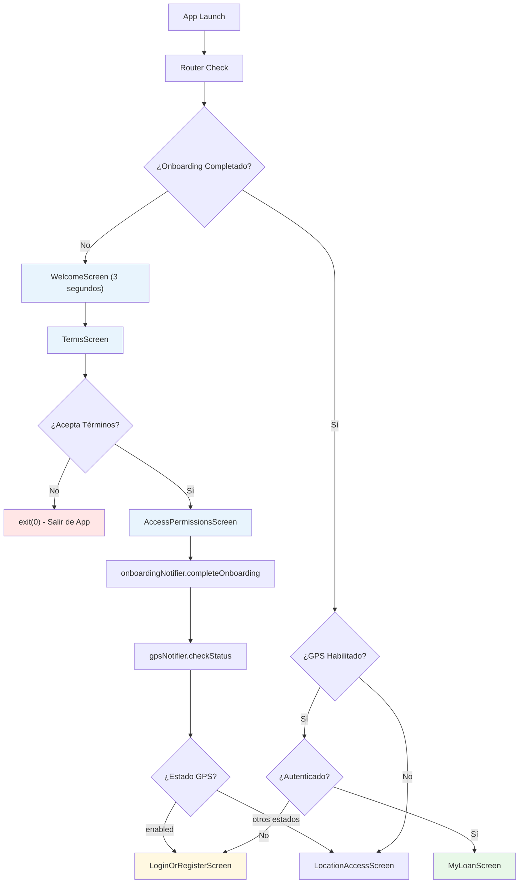

# Flujo de Onboarding - Aceptación de Términos y Permisos

Este documento describe el proceso completo de onboarding de la aplicación Pisto, que incluye la aceptación de términos y condiciones, y la solicitud de permisos de acceso.

## 1. Descripción General

Tras la instalación de la aplicación, el usuario debe completar un proceso de onboarding de tres pantallas secuenciales antes de poder acceder a las funcionalidades principales. Este proceso no requiere conexión con la API ya que toda la información necesaria forma parte de la aplicación.

### Objetivo Principal

-   Presentar la marca y propósito de la aplicación
-   Obtener la aceptación explícita de términos y condiciones
-   Informar sobre los permisos que la aplicación necesitará
-   Establecer una variable global persistente que determine si el proceso fue completado

## 2. Arquitectura del Flujo

### 2.1 Estructura de Archivos

```
lib/features/onboarding/
├── providers/
│   ├── onboarding_provider.dart      # Gestión del estado de onboarding
│   └── onboarding_provider.g.dart    # Archivo generado por riverpod_annotation
└── screens/
    ├── welcome_screen.dart           # Pantalla de bienvenida (splash)
    ├── terms_screen.dart             # Términos y condiciones
    ├── access_permissions_screen.dart # Información de permisos
    └── screens.dart                  # Exportaciones
```

### 2.2 Gestión de Estado

**OnboardingNotifier** (`onboarding_provider.dart`):

-   Utiliza `SharedPreferences` para persistir el estado de completación
-   Clave de almacenamiento: `'onboarding_completed'`
-   Proporciona métodos para verificar, completar y resetear el onboarding

```dart
enum OnboardingStep {
  notStarted,    // Usuario no ha iniciado el onboarding
  inProgress,    // Usuario está en proceso de onboarding
  completed,     // Onboarding completado exitosamente
}
```

### 2.3 Integración con Router

El onboarding está integrado con el sistema de routing mediante `RouteMiddleware`:

**Categoría de Rutas Setup:**

-   `/welcome` - WelcomeScreen
-   `/terms` - TermsScreen
-   `/access-permissions` - AccessPermissionsScreen
-   `/location-access` - LocationAccessScreen (GPS)

**Lógica de Redirección:**

```dart
// Si el onboarding no está completo
if (appState.onboardingStep != OnboardingStep.completed) {
  return _isInCategory(currentPath, RouteCategory.setup)
      ? null
      : WelcomeScreen.route;
}
```

## 3. Pantallas del Flujo

### 3.1 Pantalla de Bienvenida (`WelcomeScreen`)

**Ruta:** `/welcome`

**Funcionalidad:**

-   Primera vista tras la instalación de la aplicación
-   Muestra el logo de Pisto y mensaje de bienvenida
-   Incluye un indicador de progreso (loading spinner)
-   Navegación automática después de 3 segundos a la pantalla de términos

**Características Técnicas:**

-   Implementa `Timer` con manejo seguro del ciclo de vida
-   Verifica `mounted` antes de navegar para evitar navigation leaks
-   Cancela el timer en `dispose()` para prevenir memory leaks

**Elementos UI:**

-   Logo de Pisto
-   Título: "Bienvenido a Pisto"
-   Subtitle: "Préstamo para cualquier propósito en 24 horas"
-   Indicador de progreso circular

**Navegación:**

```dart
Timer(const Duration(seconds: 3), () {
  if (mounted) {
    context.go('/terms');
  }
});
```

### 3.2 Pantalla de Términos y Condiciones (`TermsScreen`)

**Ruta:** `/terms`

**Funcionalidad:**

-   Presenta los términos y condiciones completos de PISTO, S.A. de C.V.
-   Campo de texto de solo lectura con scroll para términos completos
-   Checkbox de aceptación que debe ser marcado para continuar
-   Botones de "Cancelar" y "Siguiente"

**Validaciones:**

-   El usuario debe llegar hasta el final del texto (implementado como scroll)
-   El checkbox debe estar marcado para activar el botón "Siguiente"
-   Si se presiona "Cancelar", la aplicación se cierra (`exit(0)`)

**Características Técnicas:**

-   TextFormField con `maxLines: 16` y `readOnly: true`
-   Checkbox personalizado con tema personalizado de la aplicación
-   Estado local para manejar la aceptación: `_acceptTermsAndConditions`

**Términos Incluidos:**
Los términos y condiciones incluyen 17 puntos que cubren:

1. Requisitos de edad
2. Responsabilidad por cargos
3. Estadísticas anónimas
4. Protección de información personal
5. Uso responsable de la aplicación
6. Prohibiciones de alteración
7. Derechos de propiedad intelectual
8. Licencia de uso
9. Responsabilidad por programas maliciosos
10. Notificaciones y comunicaciones
11. Modificaciones de términos
12. Moderación de contenidos
13. Responsabilidad del usuario
14. Suspensión del servicio
15. Uso de contactos para localización
16. Uso correcto de la aplicación
17. Jurisdicción legal

**Navegación:**

```dart
onPressed: () {
  if (_acceptTermsAndConditions) {
    context.push('/access-permissions');
  }
}
```

### 3.3 Pantalla de Permisos (`AccessPermissionsScreen`)

**Ruta:** `/access-permissions`

**Funcionalidad:**

-   Informa al usuario sobre los permisos necesarios para el funcionamiento
-   Lista los tipos de permisos que se solicitarán
-   Completa formalmente el proceso de onboarding
-   Implementa navegación inteligente basada en el estado del GPS

**Permisos Informados:**

-   Cámara
-   Galería de imágenes
-   Ubicación
-   Mensajes de texto
-   Contactos

**Lógica de Navegación Inteligente:**
Al presionar "Siguiente":

1. Marca el onboarding como completado usando `onboardingNotifier.completeOnboarding()`
2. Verifica el estado actual del GPS usando `gpsNotifier.checkStatus()`
3. Decide la navegación basada en el estado:
    - Si `GpsStatus.enabled`: navega directamente a `LoginOrRegisterScreen`
    - Si cualquier otro estado: navega a `LocationAccessScreen`

**Manejo de Errores:**

-   Try-catch para manejar errores de completación
-   SnackBar para mostrar mensajes de error al usuario
-   Verificación de `mounted` en operaciones asíncronas

**Características UI:**

-   Diseño responsivo con scroll si es necesario
-   Botones fijos en la parte inferior
-   Lista de permisos con bullets personalizados
-   Botones "Cancelar" y "Siguiente"

## 4. Flujo de Navegación



## 5. Integración con el Sistema

### 5.1 Persistencia de Estado

**SharedPreferences:**

-   Clave: `'onboarding_completed'`
-   Valor: `bool` (true/false)
-   Verificación al inicio de la aplicación

**Provider State:**

```dart
@riverpod
class OnboardingNotifier extends _$OnboardingNotifier {
  @override
  Future<bool> build() async {
    return await isOnboardingCompleted();
  }
}
```

### 5.2 Middleware de Routing

El onboarding se integra con el sistema de routing global:

```dart
// En RouteMiddleware.shouldRedirect()
if (appState.onboardingStep != OnboardingStep.completed) {
  return _isInCategory(currentPath, RouteCategory.setup)
      ? null
      : WelcomeScreen.route;
}
```

### 5.3 Estados de la Aplicación

**AppState Integration:**

-   `onboardingStep`: Estado actual del onboarding
-   `authStatus`: Estado de autenticación del usuario
-   `gpsStatus`: Estado de permisos y servicio GPS

## 6. Casos de Uso y Escenarios

### 6.1 Primera Instalación (Happy Path)

1. Usuario instala la aplicación
2. App inicia en `WelcomeScreen`
3. Después de 3 segundos → `TermsScreen`
4. Usuario lee y acepta términos → `AccessPermissionsScreen`
5. Usuario presiona "Siguiente" → Completa onboarding
6. Navegación a GPS o Login según estado del dispositivo

### 6.2 Usuario Rechaza Términos

1. Usuario llega a `TermsScreen`
2. Usuario presiona "Cancelar"
3. Aplicación se cierra con `exit(0)`

### 6.3 Error en Completación de Onboarding

1. Usuario presiona "Siguiente" en `AccessPermissionsScreen`
2. Error en `onboardingNotifier.completeOnboarding()`
3. Se muestra SnackBar con mensaje de error
4. Usuario puede intentar nuevamente

### 6.4 Usuarios Existentes

1. Usuario abre la aplicación
2. Router verifica estado de onboarding
3. Si ya completado → Redirige según estado de GPS/Auth
4. No muestra pantallas de onboarding

### 6.5 Navegación Interrupted

1. Usuario está en proceso de onboarding
2. Cierra la aplicación antes de completar
3. Al reabrir → Regresa a `WelcomeScreen`
4. Debe completar el proceso nuevamente

## 7. Consideraciones Técnicas

### 7.1 Manejo de Memoria

-   Cancelación de timers en `dispose()`
-   Verificación de `mounted` antes de operaciones asíncronas
-   Limpieza de listeners en widgets StatefulWidget

### 7.2 Experiencia de Usuario

-   **Navegación fluida**: Transiciones automáticas sin interrupciones
-   **Feedback claro**: Mensajes de error comprensibles
-   **Validación progresiva**: Botones se activan solo cuando es apropiado
-   **Persistencia**: Estado se mantiene entre sesiones

### 7.3 Robustez

-   **Error Handling**: Try-catch en operaciones críticas
-   **State Management**: Uso de Riverpod para estado reactivo
-   **Lifecycle Management**: Manejo apropiado del ciclo de vida de widgets
-   **Network Independence**: Funciona completamente offline

### 7.4 Seguridad y Privacidad

-   **Información Local**: Términos integrados en la app
-   **Consentimiento Explícito**: Usuario debe aceptar activamente
-   **Transparencia**: Clara información sobre permisos necesarios

### 7.5 Dependencias Utilizadas

-   **riverpod_annotation**: Para generación automática de providers
-   **shared_preferences**: Para persistencia del estado de onboarding
-   **go_router**: Para navegación declarativa entre pantallas
-   **flutter/material**: Para componentes de UI

## 8. Testing y Debugging

### 8.1 Métodos de Utilidad

```dart
// Para resetear onboarding durante desarrollo/testing
Future<void> resetOnboarding() async {
  final prefs = await SharedPreferences.getInstance();
  await prefs.remove(_onboardingKey);
}
```

### 8.2 Logs de Debug

-   Router incluye logs de redirección para debugging
-   Estados de aplicación son observables en desarrollo

### 8.3 Escenarios de Testing

-   Completación exitosa del onboarding
-   Rechazo de términos y condiciones
-   Interrupciones del flujo
-   Persistencia entre sesiones
-   Navegación con diferentes estados de GPS/Auth

## 9. Mantenimiento y Actualizaciones

### 9.1 Actualización de Términos

Los términos están hardcodeados en `TermsScreen`. Para actualizaciones:

1. Modificar el `initialValue` del TextFormField
2. Considerar versionado de términos si es necesario
3. Evaluar si requiere re-aceptación de usuarios existentes

### 9.2 Evolución del Onboarding

-   El sistema está diseñado para ser extensible
-   Nuevas pantallas pueden agregarse a la categoría `RouteCategory.setup`
-   El estado del onboarding puede evolucionar a un enum más complejo si es necesario

### 9.3 Métricas y Analytics

Considerar agregar tracking para:

-   Tasa de completación del onboarding
-   Puntos de abandono en el flujo
-   Tiempo promedio de completación
-   Rechazos de términos y condiciones
