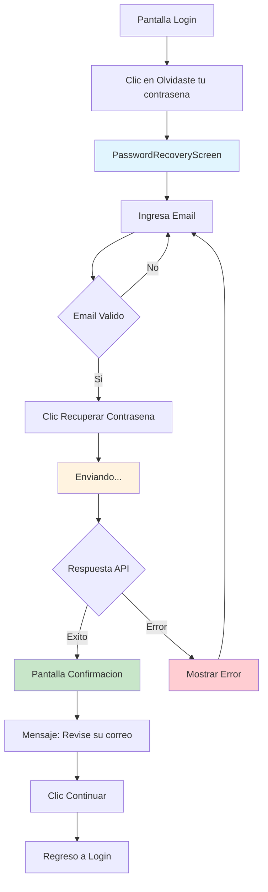

## Descripción General

La funcionalidad de recuperación de contraseña permite a los usuarios que han olvidado su contraseña recuperar el acceso a su cuenta mediante un proceso de verificación por correo electrónico. El flujo está implementado siguiendo la arquitectura feature-based de la aplicación y utiliza Riverpod para la gestión de estado.

## Arquitectura de la Implementación

### Estructura de Archivos

```
lib/features/auth/
├── screens/
│   └── password_recovery_screen.dart          # UI principal del flujo
├── providers/
│   └── password_recovery_form_provider.dart   # Gestión de estado del formulario
├── models/
│   ├── password_recovery_request.dart         # DTO para la petición
│   └── password_recovery_response.dart        # DTO para las respuestas
└── data/
    └── password_recovery_repository.dart      # Capa de datos y API
```

## Flujo de Usuario (UX)

### 1. Acceso a la Funcionalidad

-   El usuario accede desde la pantalla de login
-   Pulsa el enlace "¿Olvidaste tu contraseña?"
-   Navega a `/password-recovery`

### 2. Formulario de Recuperación

**Pantalla:** `PasswordRecoveryScreen`

**Elementos UI:**

-   Header con logo de Pisto
-   Botón de retroceso
-   Título: "Recuperación de contraseña"
-   Texto explicativo: "Para recuperar su contraseña, proporcione su dirección de correo electrónico registrada en Pisto."
-   Campo de entrada para email con validación
-   Botón "Recuperar contraseña"
-   Enlace para regresar a login: "¿Ya tienes cuenta? Ingresa a tu cuenta"

**Estados del Formulario:**

-   `initial`: Estado inicial del formulario
-   `inProgress`: Enviando petición (muestra "Enviando...")
-   `success`: Email enviado exitosamente
-   `failure`: Error en la petición

### 3. Confirmación de Envío

**Cuando la petición es exitosa:**

-   Muestra mensaje: "Revise su correo electrónico para continuar con el proceso de recuperación de contraseña"
-   Botón "Continuar" que regresa a la pantalla de login
-   Nota importante: "\*Importante: No olvide revisar la carpeta de su CORREO NO DESEADO"
-   Mantiene el enlace para regresar a login

## Implementación Técnica

### 1. Gestión de Estado (`PasswordRecoveryFormNotifier`)

**Estado (`PasswordRecoveryState`):**

```dart
@freezed
abstract class PasswordRecoveryState with _$PasswordRecoveryState {
  const factory PasswordRecoveryState({
    @Default(EmailInput.pure()) EmailInput email,
    @Default(false) bool isLoading,
    @Default(false) bool isSuccess,
    @Default('') String errorMessage,
    @Default(FormzSubmissionStatus.initial) FormzSubmissionStatus status,
  }) = _PasswordRecoveryState;
}
```

**Métodos Principales:**

-   `onEmailChange(String value)`: Actualiza el campo email y valida
-   `onFormSubmit()`: Envía la petición al backend
-   `resetState()`: Reinicia el estado del formulario

### 2. Validación del Formulario

-   Utiliza `EmailInput` de la capa compartida para validación de email
-   Validación en tiempo real usando Formz
-   El botón de envío se habilita solo cuando el formulario es válido

### 3. Capa de Datos (`PasswordRecoveryRepository`)

**Endpoint:** `POST /forgot-password`

**Request Model:**

```dart
class PasswordRecoveryRequest {
  final String email;
  Map<String, dynamic> toJson() => {'email': email};
}
```

**Response Model (Éxito):**

```dart
class PasswordRecoveryResponse {
  final PasswordRecoveryData data;
}

class PasswordRecoveryData {
  final String message; // "Revise su correo electrónico..."
}
```

### 4. Manejo de Errores

**Códigos de Respuesta:**

-   `200`: Éxito - Email enviado
-   `422`: Error de validación (email no registrado, formato inválido, campo requerido)
-   `500+`: Error del servidor
-   Timeout: Error de conexión

**Errores Específicos Manejados:**

-   Email no registrado en el sistema
-   Formato de email inválido
-   Campo email obligatorio
-   Errores de conexión/red
-   Errores del servidor

## Contratos API

### Request

```json
POST /forgot-password
Content-Type: application/json
Accept: application/json
Language: "es"

{
  "email": "user@mail.example"
}
```

### Response Exitosa (200)

```json
{
    "data": {
        "message": "Revise su correo electrónico para continuar con el proceso de recuperación de contraseña"
    }
}
```

### Response de Error (422)

```json
{
    "errors": [
        {
            "code": "Specific API Error",
            "message": "El usuario con el correo electrónico suministrado no está registrado en el sistema"
        }
    ]
}
```

**Posibles Mensajes de Error:**

-   "El usuario con el correo electrónico suministrado no está registrado en el sistema"
-   "El campo correo electrónico es obligatorio"
-   "El campo correo electrónico no tiene un formato válido"

### Validaciones Backend

```json
{
    "email": {
        "rules": ["required", "email", "exists:database"]
    }
}
```

## Integración con la Arquitectura

### Estado Global

-   Se integra con el sistema de navegación de GoRouter
-   Utiliza el `HttpClient` global con interceptores de auth y error
-   Maneja errores usando el sistema de SnackBar de la aplicación (`PistoSnackBar`)

### Navegación

-   Ruta definida: `/password-recovery`
-   Navegación mediante `context.pop()` para regresar a login
-   No requiere autenticación previa (ruta pública)

### Reutilización de Componentes

-   `CustomTextField`: Campo de entrada reutilizable
-   `PrimaryBtn`: Botón principal de la aplicación
-   `DarkBackground`: Fondo oscuro estándar
-   `PistoSnackBar`: Sistema de notificaciones

## Consideraciones de Seguridad

1. **No exposición de información**: El sistema no revela si un email existe en la BD en la respuesta exitosa
2. **Validación del lado servidor**: Todas las validaciones críticas se realizan en el backend
3. **Rate limiting**: (Implementado en el backend)
4. **Headers de idioma**: Se envía header `Language: "es"` para respuestas localizadas

## Flujo de Estados UX

```
[Pantalla Login]
    ↓ (tap "¿Olvidaste tu contraseña?")
[Formulario Recuperación]
    ↓ (ingresa email válido + tap "Recuperar contraseña")
[Estado: enviando...]
    ↓ (éxito)
[Pantalla Confirmación]
    ↓ (tap "Continuar")
[Pantalla Login]
```

**En caso de error:**

```
[Estado: enviando...]
    ↓ (error)
[Formulario Recuperación + SnackBar Error]
    ↓ (usuario corrige y reintenta)
```


