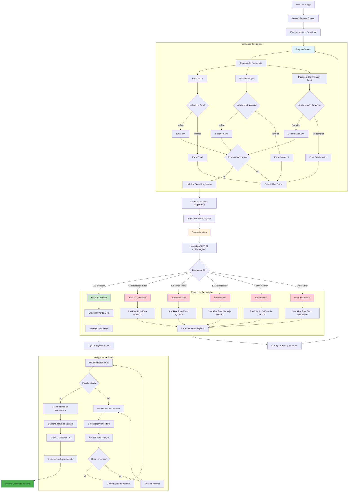

## Descripción General

El flujo de registro de usuario permite a nuevos usuarios crear una cuenta en la aplicación Pisto proporcionando su correo electrónico, contraseña y confirmación de contraseña. El proceso incluye validaciones tanto en el frontend como en el backend, manejo de errores específicos, y un flujo de verificación por correo electrónico.

## Arquitectura Implementada

### Estructura de Directorios

```
lib/features/auth/
├── screens/
│   ├── register_screen.dart          # Pantalla principal de registro
│   ├── email_verification_screen.dart # Pantalla de verificación de email
│   └── login_or_register_screen.dart  # Pantalla inicial
├── models/
│   ├── register_request.dart          # Modelo para petición de registro
│   └── register_response.dart         # Modelo para respuesta de registro
├── providers/
│   ├── register_form_provider.dart    # Gestión de estado del formulario
│   └── register_provider.dart         # Gestión de estado del proceso
├── repositories/
│   └── auth_repository.dart           # Comunicación con API
└── shared/inputs/
    ├── email_input.dart               # Validación de email
    ├── password_input.dart            # Validación de contraseña
    └── password_confirmation_input.dart # Validación de confirmación
```

## Contratos de API

### Endpoint de Registro

-   **Método:** `POST`
-   **URL:** `/mobile/register`
-   **Headers:**
    -   `Content-Type: application/json`
    -   `Accept: application/json`
    -   `Language: "es"`

### Request Payload

```json
{
    "email": "user@mail.example",
    "password": "Passw0rd#",
    "password_confirmation": "Passw0rd#"
}
```

### Respuestas de la API

### Registro Exitoso (201)

```json
{
    "data": {
        "message": "Revise su correo electrónico para continuar con el proceso de registro"
    }
}
```

### Errores de Validación (422)

```json
{
    "errors": [
        {
            "code": "Specific API Error",
            "message": "El usuario con el correo electrónico suministrado ya existe"
        },
        {
            "code": "Specific API Error",
            "message": "La confirmación de contraseña es incorrecta"
        }
    ]
}
```

## Validaciones Frontend

### Validación de Email (EmailInput)

-   **Campo requerido:** No puede estar vacío
-   **Formato válido:** Expresión regular: `^[\w-\.]+(\ +[\w-]+)?@([\w-]+\.)+[\w-]{2,}$`
-   **Mensajes de error:**
    -   Vacío: "El email es requerido"
    -   Inválido: "Ingresa un email válido"

### Validación de Contraseña (PasswordInput)

-   **Campo requerido:** No puede estar vacío
-   **Longitud mínima:** 8 caracteres
-   **Complejidad requerida:**
    -   Al menos una mayúscula (A-Z)
    -   Al menos una minúscula (a-z)
    -   Al menos un número (0-9)
    -   Al menos un carácter especial (!@#$%^&\*(),.?":{}|\<\>)
-   **Mensajes de error:**
    -   Vacío: "La contraseña es requerida"
    -   Muy corta: "La contraseña debe tener al menos 8 caracteres"
    -   Débil: "La contraseña debe tener mayúscula, minúscula, número y símbolo"

### Validación de Confirmación (PasswordConfirmationInput)

-   **Campo requerido:** No puede estar vacío
-   **Coincidencia:** Debe ser idéntica a la contraseña
-   **Mensajes de error:**
    -   Vacío: "Confirma tu contraseña"
    -   No coincide: "Las contraseñas no coinciden"

## Flujo de Usuario Detallado

### 1. Pantalla de Registro (RegisterScreen)

-   **Ruta:** `/register`
-   **Acceso:** Desde pantalla inicial pulsando botón "Regístrate"
-   **Componentes principales:**
    -   Header con logo de Pisto
    -   Formulario con 3 campos:
        -   Correo Electrónico
        -   Contraseña (con botón mostrar/ocultar)
        -   Confirmar contraseña (con botón mostrar/ocultar)
    -   Botón "Registrarse" (habilitado solo cuando el formulario es válido)
    -   Link "¿Ya tienes cuenta? Ingresa a tu cuenta"

### 2. Proceso de Validación

-   **Validación en tiempo real:** Los campos se validan mientras el usuario escribe
-   **Estado del botón:** Se habilita solo cuando todos los campos son válidos
-   **Indicadores visuales:** Errores mostrados debajo de cada campo

### 3. Envío del Formulario

-   **Estado de carga:** Botón cambia a "Registrando..." durante el proceso
-   **Gestión de estado:** Utiliza Riverpod para manejar estados (initial, loading, success, error)

### 4. Manejo de Respuestas

### Registro Exitoso

-   **Mensaje:** SnackBar verde con mensaje de éxito
-   **Navegación:** Redirección automática a pantalla de login/registro

### Errores del Servidor

-   **422 - Validación:** Muestra mensaje específico del servidor
-   **409 - Email existente:** "El email ya está registrado"
-   **400 - Bad Request:** Mensaje del servidor
-   **Otros errores:** "Error inesperado. Intenta nuevamente."

### 5. Verificación de Email

### Pantalla de Verificación (EmailVerificationScreen)

-   **Ruta:** `/email-verification`
-   **Propósito:** Permitir reenvío de correo de verificación
-   **Estados:**
    -   Vista inicial: Solicita verificación o reenvío
    -   Vista de confirmación: Confirma reenvío exitoso

### Funcionalidades

-   **Reenviar correo:** Botón para reenviar código de verificación
-   **Cancelar:** Regreso a pantalla inicial
-   **Indicador de carga:** Deshabilitación durante procesamiento
-   **Recordatorio:** Texto sobre revisar correo no deseado



## Estados de Usuario en Backend

### Al Registrarse

-   **Status = 1:** Usuario registrado pero inactivo
-   **validated_at:** Null (sin verificar)
-   **Envío de email:** Automático tras registro exitoso

### Al Verificar Email

-   **Status = 2:** Usuario activo
-   **validated_at:** Timestamp de verificación
-   **Generación de promocode:** Código alfanumérico de 7 caracteres únicos

## Manejo de Errores

### Arquitectura de Excepciones

```dart
class AuthException implements Exception {
  final String message;
  final int? statusCode;
  final AuthExceptionType type;
  final dynamic data;
}

enum AuthExceptionType {
  network,
  validation,
  unauthorized,
  unknown
}
```

### Tipos de Errores Manejados

1. **Errores de red (DioException):** Convertidos a NetworkException y luego AuthException
2. **Errores de validación:** Mensajes específicos del servidor
3. **Errores inesperados:** Mensaje genérico para el usuario

## Gestión de Estado con Riverpod

### RegisterFormProvider

-   **Responsabilidad:** Gestión del estado del formulario
-   **Estados:**
    -   Campos individuales (email, password, passwordConfirmation)
    -   Visibilidad de contraseñas
    -   Estado de envío (FormzSubmissionStatus)
-   **Métodos principales:**
    -   `onEmailChange()`, `onPasswordChange()`, `onPasswordConfirmationChange()`
    -   `togglePasswordVisibility()`, `togglePasswordConfirmationVisibility()`
    -   `toRequest()`: Conversión a modelo de request

### RegisterProvider

-   **Responsabilidad:** Gestión del proceso de registro
-   **Estados:** initial, loading, success, error
-   **Método principal:** `register()` - Ejecuta el flujo completo

## Características de UX/UI

### Diseño Visual

-   **Tema oscuro:** Background con imagen de anillos
-   **Formulario:** Container blanco con border radius en esquina superior izquierda
-   **Tipografía:** Fuentes Pisto con jerarquía visual clara
-   **Espaciado:** Consistente con guía de diseño de la aplicación

### Interactividad

-   **Dismissal de teclado:** Tap fuera del formulario para ocultar teclado
-   **Scroll behavior:** Dismiss del teclado al hacer scroll
-   **Estados de botón:** Visual feedback durante carga
-   **Toggles de contraseña:** Iconos de ojo para mostrar/ocultar

### Navegación

-   **Back navigation:** Automática con go_router
-   **Forward navigation:** Condicional basada en estados
-   **Deep linking:** Soporte para rutas específicas

## Consideraciones de Seguridad

### Frontend

-   **Validación de inputs:** Prevención de datos malformados
-   **Limpieza de estado:** Clear de tokens antes de nuevos registros
-   **Manejo seguro de contraseñas:** No almacenamiento en estado persistente

### Backend (según contratos)

-   **Validación de formato:** Email y contraseña según reglas específicas
-   **Unicidad de email:** Verificación en base de datos
-   **Códigos promocionales:** Generación única y verificación de duplicados
-   **Estados de usuario:** Control de acceso basado en verificación
