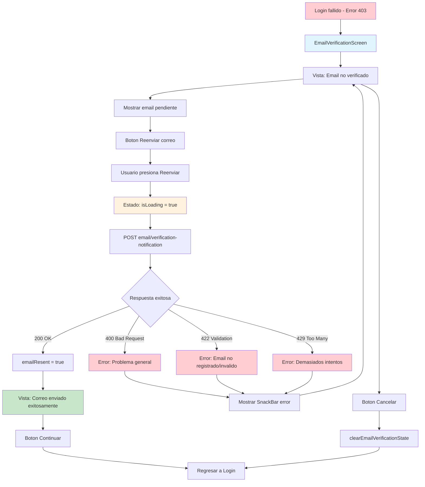

## Descripción General

El flujo de validación de email se activa cuando un usuario intenta hacer login pero su email no ha sido verificado (error 403). Permite al usuario reenviar el correo de verificación y completar el proceso de validación de su dirección de email. Está integrado con el sistema de autenticación y utiliza Riverpod para la gestión de estado.

## Arquitectura de la Implementación

### Estructura de Archivos

```
lib/features/auth/
├── screens/
│   └── email_verification_screen.dart         # UI principal del flujo
├── providers/
│   └── auth_provider.dart                     # Gestión de estado (incluye reenvío)
├── repositories/
│   └── auth_repository.dart                   # Capa de datos para reenvío de email
└── core/exceptions/
    └── email_not_verified_exception.dart      # Excepciones específicas
```

## Flujo de Usuario (UX)

### 1. Activación del Flujo

-   Se accede desde el login cuando el backend retorna código 403
-   El usuario intentó autenticarse pero su email no está verificado
-   La app redirige automáticamente a `EmailVerificationScreen`

### 2. Pantalla de Verificación de Email

**Pantalla:** `EmailVerificationScreen`

**Vista Inicial - Email No Verificado:**

-   Mensaje explicativo sobre la necesidad de verificar el email
-   Botón "Reenviar correo" (principal)
-   Botón "Cancelar" (secundario)
-   Nota importante sobre revisar correo no deseado

**Vista Post-Reenvío - Correo Enviado:**

-   Confirmación de que el correo fue reenviado exitosamente
-   Botón "Continuar" para regresar al login
-   Nota importante sobre revisar correo no deseado

### 3. Estados del Flujo

-   `emailNotVerified`: Estado inicial, muestra opciones de reenvío
-   `emailResent`: Correo reenviado exitosamente
-   `isLoading`: Procesando reenvío de correo
-   `error`: Error en el proceso de reenvío

## Diagrama de Flujo



## Implementación Técnica

### 1. Gestión de Estado (`AuthNotifier`)

**Estados relacionados con verificación:**

```dart
@freezed
abstract class AuthState with _$AuthState {
  const factory AuthState({
    @Default(AuthStatus.unauthenticated) AuthStatus status,
    @Default(null) String? pendingVerificationEmail,
    @Default(false) bool emailResent,
    @Default(false) bool isLoading,
    @Default(null) String? errorMessage,
  }) = _AuthState;
}
```

**Método principal de reenvío:**

```dart
Future<bool> resendVerificationCode(String email) async {
  try {
    state = state.copyWith(isLoading: true, errorMessage: null);

    await _authRepository.resendVerificationCode(email);

    state = state.copyWith(
      isLoading: false,
      successMessage: 'Código de verificación enviado exitosamente',
      emailResent: true,
    );

    return true;
  } catch (e) {
    // Manejo de errores específicos
    return false;
  }
}
```

### 2. Capa de Datos (`AuthRepository`)

**Endpoint:** `POST /mobile/email/verification-notification`

**Método de reenvío:**

```dart
Future<void> resendVerificationCode(String email) async {
  try {
    final response = await _httpClient.post(
      '/mobile/email/verification-notification',
      data: {'email': email},
    );

    if (response.statusCode != 200) {
      throw EmailNotVerifiedException.verificationCodeNotSent();
    }
  } on DioException catch (e) {
    // Manejo específico de códigos de error
    // 400: Error general
    // 422: Validación (email no registrado/formato inválido)
    // 429: Demasiados intentos
  }
}
```

### 3. Manejo de Excepciones

**Tipos específicos de errores:**

```dart
enum EmailNotVerifiedExceptionType {
  emailNotVerified,
  verificationExpired,
  verificationCodeNotSent,
  tooManyVerificationAttempts,
}
```

**Factory constructors para diferentes escenarios:**

-   `EmailNotVerifiedException.emailNotVerified()`: Email no verificado
-   `EmailNotVerifiedException.verificationExpired()`: Código expirado
-   `EmailNotVerifiedException.verificationCodeNotSent()`: Error al enviar código
-   `EmailNotVerifiedException.tooManyAttempts()`: Demasiados intentos

## Contratos API

### Request

```json
POST /mobile/email/verification-notification
Content-Type: application/json
Accept: application/json
Language: "es"

{
  "email": "user@mail.example"
}
```

### Response Exitosa (200)

```json
{
    "data": {
        "message": "Revise su correo electrónico para validar su dirección de correo y poder acceder al sistema"
    }
}
```

### Response Error General (400)

```json
{
    "errors": [
        {
            "code": "Specific API Error",
            "message": "Se ha producido un error, intente nuevamente"
        }
    ]
}
```

### Response Error de Validación (422)

```json
{
    "errors": [
        {
            "code": "Specific API Error",
            "message": "El correo electrónico introducido no se encuentra registrado en nuestro sistema"
        },
        {
            "code": "Specific API Error",
            "message": "El campo correo electrónico es obligatorio"
        },
        {
            "code": "Specific API Error",
            "message": "El campo correo electrónico no tiene un formato válido"
        }
    ]
}
```

### Validaciones Backend

```json
{
    "email": {
        "rules": ["required", "email"]
    }
}
```

## Integración con el Flujo de Autenticación

### 1. Activación desde Login

Cuando `AuthRepository.login()` recibe un error 403:

```dart
if (networkError.statusCode == 403) {
  throw EmailNotVerifiedException.emailNotVerified(
    statusCode: networkError.statusCode,
    data: networkError.data,
  );
}
```

### 2. Captura en AuthNotifier

```dart
} on EmailNotVerifiedException catch (e) {
  state = state.copyWith(
    status: AuthStatus.withOutEmailVerification,
    errorMessage: e.message,
    isLoading: false,
    pendingVerificationEmail: email, // Guarda el email para reenvío
  );
}
```

### 3. Navegación Automática

El middleware de rutas detecta el estado `withOutEmailVerification` y redirige a `/email-verification`.

## Funcionalidades de la UI

### 1. Vista Inicial (`_buildInitialView`)

**Elementos:**

-   Mensaje explicativo largo sobre verificación necesaria
-   Botón "Reenviar correo" (deshabilitado durante carga)
-   Botón "Cancelar" (limpia estado y regresa a login)
-   Nota sobre correo no deseado

### 2. Vista Post-Reenvío (`_buildEmailSentView`)

**Elementos:**

-   Confirmación de reenvío exitoso
-   Botón "Continuar" (regresa a login)
-   Nota sobre correo no deseado

### 3. Gestión de Estados

-   Durante carga: botón deshabilitado, sin spinner adicional
-   Error: SnackBar con mensaje específico del error
-   Éxito: transición automática a vista de confirmación

## Manejo de Errores

### Códigos de Error Específicos

-   **400**: Error general del servidor - "Se ha producido un error, intente nuevamente"
-   **422**: Errores de validación:
    -   Email no registrado en el sistema
    -   Campo email obligatorio
    -   Formato de email inválido
-   **429**: Demasiados intentos - Rate limiting

### Estados de Error en UI

-   Errores se muestran via `PistoSnackBar.showError()`
-   Usuario puede reintentar inmediatamente después del error
-   No hay límites del lado cliente (solo servidor)

## Consideraciones de UX

### 1. Persistencia de Datos

-   El email del usuario se guarda en `pendingVerificationEmail`
-   No requiere que el usuario vuelva a ingresar su email
-   Se limpia automáticamente al cancelar o completar el flujo

### 2. Instrucciones Claras

-   Mensaje detallado sobre qué hacer después de recibir el correo
-   Recordatorio sobre revisar correo no deseado
-   Diferenciación clara entre estado inicial y post-reenvío

### 3. Navegación

-   Botón "Cancelar" regresa a login/register screen
-   Botón "Continuar" (después del reenvío) regresa a login
-   Estado se limpia completamente al salir del flujo

## Integración con la Arquitectura

### Estado Global

-   Integrado completamente con `AuthNotifier`
-   No requiere providers adicionales
-   Estado sincronizado con el flujo de autenticación principal

### Navegación

-   Ruta definida: `/email-verification`
-   Activación automática desde middleware de autenticación
-   Limpieza de estado al salir con `clearEmailVerificationState()`

### Componentes Reutilizados

-   `PrimaryBtn` y `SecondaryBtn` del design system
-   `PistoSnackBar` para mensajes de error/éxito
-   `DarkBackground` y `HeaderDarkBackground` para consistencia visual
