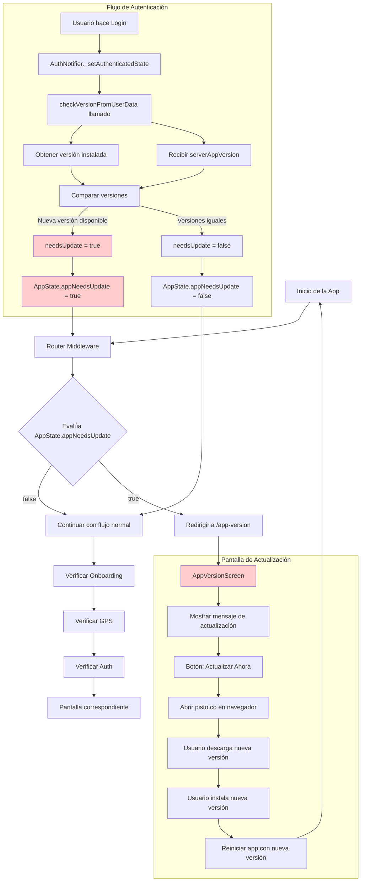

# Flujo de Verificación de Versión

Este documento detalla el proceso de verificación de versión en la aplicación, desde el requerimiento inicial hasta la implementación técnica final.

## 1. Requerimiento

La aplicación implementa un sistema de verificación de versión que se ejecuta en **dos momentos específicos**:

1. **Al cargar datos del cliente**: Cuando el usuario hace login o se autentica, la verificación se realiza usando la versión que viene en los datos del usuario (`appVersion` del endpoint `/mobile/client/data`).

2. **Al abrir la aplicación**: Para futuras implementaciones, existe un endpoint dedicado `/mobile/check-version` que permite verificar la versión independientemente.

### Comportamiento del Sistema:

-   Si las versiones son **iguales**, se procederá con el flujo normal de la aplicación.
-   Si son **diferentes**, la app redirige automáticamente a la pantalla de actualización (`AppVersionScreen`) y **bloquea el acceso** al resto de la aplicación.
-   En caso de **error** en la comunicación con la API, se mantiene el estado actual y se permite continuar con el flujo normal.

### Variable Global de Versión

La aplicación mantiene una variable global que contiene la versión instalada, obtenida automáticamente usando `package_info_plus`. Esta versión se muestra en el panel lateral de la aplicación.

## 2. Especificación Técnica del API

### 2.1. Verificación Integrada con Datos del Cliente

La verificación principal se realiza a través del endpoint existente cuando el usuario hace login:

**`GET`** `/mobile/client/data`

-   **Request Headers**:

    -   content-type: application/json
    -   accept: application/json
    -   Authorization: Bearer `{token}`
    -   Language: "es"

-   **Success Response** (incluye `appVersion`):

```json
{
    "data": {
        "appVersion": "1.2.2",
        "id": 14,
        "name": "Pedro",
        "surname": "Martínez",
        "email": "prueba@prueba.com",
        "profile": { ... },
        "job": { ... }
    }
}
```

### 2.2. Endpoint Dedicado de Verificación (Futuro)

Para verificaciones independientes, existe el endpoint:

**`GET`** `/mobile/check-version`

-   **Request Headers**:

    -   content-type: application/json
    -   accept: application/json
    -   Language: "es"

-   **Success Response**:

```json
{
    "data": {
        "version": "1.2.2"
    }
}
```

### 2.3. Nota para Backend

La información de la versión está almacenada en la tabla `app_versions` en la base de datos. Se envía el contenido del campo `version` del último registro de dicha tabla tanto en el endpoint de datos del cliente como en el endpoint dedicado de verificación.

## 3. Implementación

El flujo de verificación de versión está integrado con el sistema de autenticación y enrutamiento, ejecutándose automáticamente cuando el usuario se autentica.

### 3.1. Arquitectura de Componentes

**Componentes principales:**

1. **`AppVersionStateNotifier`**: Provider que maneja el estado de verificación de versión
2. **`AppVersionScreen`**: Pantalla que se muestra cuando se necesita actualizar
3. **`RouteMiddleware`**: Middleware que intercepta navegación y redirige según el estado
4. **`AppState`**: Estado global que incluye `appNeedsUpdate` basado en el provider de versión

### 3.2. Flujo de Verificación Automática

**Momento de ejecución**: La verificación se ejecuta automáticamente durante el proceso de autenticación:

1. **Login del Usuario**: Cuando el usuario hace login exitoso, `AuthNotifier._setAuthenticatedState()` se ejecuta
2. **Verificación Automática**: Se llama `_appVersionNotifier.checkVersionFromUserData(loginResponse.user.appVersion)`
3. **Comparación de Versiones**:
    - Obtiene versión instalada con `PackageInfo.fromPlatform()`
    - Compara con `serverAppVersion` usando comparación semántica
    - Actualiza `AppVersionState` con resultado (`needsUpdate: true/false`)

### 3.3. Lógica del Middleware de Rutas

El `RouteMiddleware.shouldRedirect()` evalúa el estado y redirige según prioridades:

```dart
// Primera prioridad: Verificación de versión
if (appState.appNeedsUpdate) {
  return currentPath != AppVersionScreen.route
      ? AppVersionScreen.route
      : null;
}

// Continúa con otras verificaciones (onboarding, GPS, auth)...
```

**Comportamiento**:

-   Si `appNeedsUpdate` es `true`, **bloquea toda navegación** y fuerza redirección a `/app-version`
-   El usuario queda "atrapado" en `AppVersionScreen` hasta actualizar la app
-   No hay forma de continuar sin actualizar (comportamiento intencional)

### 3.4. Pantalla de Actualización (`AppVersionScreen`)

La pantalla muestra una interfaz simple con:

-   **Logo de la aplicación**
-   **Mensaje**: "Parece que necesitas actualizar versión"
-   **Instrucciones**: "Entra a pisto.co para descargar la nueva version"
-   **Botón "Actualizar Ahora"**: Redirige a `https://pisto.co` usando `url_launcher`

**Características**:

-   No tiene opción "Omitir" o "Cancelar" (bloqueo total)
-   Abre el navegador externo al presionar "Actualizar Ahora"
-   Permanece visible incluso después de volver del navegador

## 4. Diagrama del Flujo



## 5. Manejo de Errores

### 5.1. Estrategia Actual

La implementación actual maneja errores de forma **conservadora**:

```dart
try {
  // Verificación de versión
  final needsUpdate = _isVersionNewer(serverAppVersion, currentVersion);
  state = state.copyWith(needsUpdate: needsUpdate, isLoading: false);
} catch (e) {
  // En caso de error, NO bloquear la app
  state = state.copyWith(
    errorMessage: e.toString(),
    isLoading: false,
    hasBeenChecked: true,
  );
}
```

**Comportamiento con errores**:

-   Si falla la comparación de versiones, se permite continuar con el flujo normal
-   No se muestra pantalla de error al usuario
-   Se registra el error en logs para debugging

### 5.2. Diferencias con Requerimientos Originales

**Requerimiento original P1D**: "_En caso de error en la comunicación con la API se mostrará el error correspondiente_"

**Implementación actual**: No hay manejo de errores de UI porque la verificación se ejecuta durante el login, donde ya existe manejo de errores de autenticación.

## 6. Notas de Implementación

### 6.1. Comparación Semántica de Versiones

La aplicación implementa comparación semántica personalizada:

```dart
bool _isVersionNewer(String serverVersion, String currentVersion) {
  final serverParts = serverVersion.split('.').map(int.parse).toList();
  final currentParts = currentVersion.split('.').map(int.parse).toList();

  // Compara parte por parte (major.minor.patch)
  for (int i = 0; i < maxLength; i++) {
    if (serverParts[i] > currentParts[i]) return true;
    if (serverParts[i] < currentParts[i]) return false;
  }
  return false; // Son iguales
}
```

### 6.2. Estado Global Integrado

La verificación de versión está integrada en el `AppState` global:

```dart
@freezed
abstract class AppState with _$AppState {
  const factory AppState({
    @Default(false) bool appNeedsUpdate,  // 🎯 Flag de actualización
    // ... otros estados
  }) = _AppState;
}
```

### 6.3. Prioridad en Middleware

En el `RouteMiddleware`, la verificación de versión tiene **máxima prioridad**:

1. ✅ **Verificación de versión** (bloquea todo)
2. Onboarding
3. GPS
4. Autenticación
5. Carga de contactos
