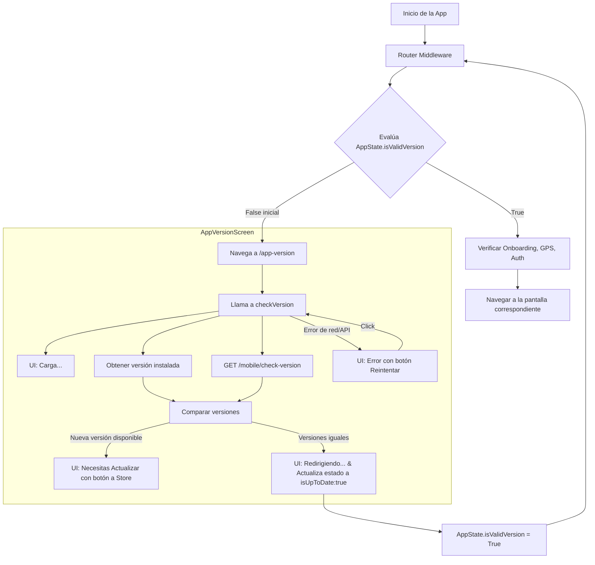

# Flujo de Verificación de Versión

Este documento detalla el proceso de verificación de versión en la aplicación, desde el requerimiento inicial hasta la implementación técnica final.

## 1. Requerimiento

Lo primero que la App hará cada vez que sea abierta será verificar si la versión instalada es la más actual. Para ello, cada vez que se abra la aplicación, se solicitará a la API la versión más actual de la misma y se comparará con la versión instalada.

-   Si las versiones son **iguales**, se procederá con el flujo normal de la aplicación.
-   Si son **diferentes**, se mostrará una ventana informativa con un botón de redirección al store correspondiente para la descarga de la aplicación actualizada.
-   En caso de **error** en la comunicación con la API, se mostrará el error correspondiente con una opción para reintentar.

### 1.1. Variable Global de Versión

La aplicación debe tener una variable global o de entorno que contenga la versión de la misma. Esta versión aparecerá en la parte inferior del panel lateral izquierdo desplegable de la aplicación.

## 2. Especificación Técnica del API

### 2.1. Endpoint de Verificación

**`GET`** `/mobile/check-version`

#### Request

-   **URL Params**: None
-   **Request Headers**:
    -   content-type: application/json
    -   accept: application/json
    -   Language: "es"
-   **Request Payload**: None

#### Response

-   **Response Headers**:
    -   content-type: application/json

#### Success Response

-   **Code**: `200`
-   **Content**:

```json
{
    "data": {
        "version": "1.2.2"
    }
}
```

#### Error Response

-   **Code**: `400`
-   **Content**:

```json
{
    "errors": [
        {
            "code": "Specific API Error",
            "message": "Se ha producido un error, intente nuevamente"
        }
    ]
}
```

### 2.2. Nota para Backend

La información de la versión estará almacenada en base de datos en la tabla `app_versions`. Se enviará a la App el contenido del campo `version` del último registro de dicha tabla.

## 3. Implementación

El flujo implementado es gestionado por el sistema de enrutamiento (`GoRouter`) y un estado global (`AppState`), asegurando que la verificación de versión sea el primer paso obligatorio antes de acceder a cualquier otra parte de la aplicación.

### 3.1. Punto de Entrada y Redirección

1. **Middleware de Rutas**: Al iniciar la aplicación, un `RouteMiddleware` intercepta la navegación.
2. **Estado Global `AppState`**: El middleware consulta el `AppState`, que a su vez depende del `appVersionStateNotifierProvider`. Una propiedad clave de este estado es `isValidVersion`.
3. **Redirección Inicial**: Por defecto, `isValidVersion` es `false`. Esto provoca que el router redirija forzosamente al usuario a la pantalla de verificación: `AppVersionScreen` (ruta `/app-version`).

### 3.2. Lógica de Verificación

La `AppVersionScreen` es el núcleo del proceso:

1. **Inicio de la Verificación**: Al construirse la pantalla (`initState`), invoca el método `checkVersion()` del `appVersionStateNotifierProvider`. Mientras tanto, muestra una interfaz de carga.
2. **Ejecución Asíncrona (`checkVersion`)**:
    - Obtiene la versión instalada en el dispositivo usando el paquete `package_info_plus`.
    - Consulta la última versión disponible desde la API a través del `AppVersionRepository` usando el endpoint `GET /mobile/check-version`.
    - Compara ambas versiones semánticamente (ej: "1.2.3" vs "1.2.2") usando el método `isNewerThan` de la `AppVersionEntity`.
    - Finalmente, actualiza el `AppVersionState` con el resultado.

### 3.3. Flujo del Usuario según el Resultado

La `AppVersionScreen` reacciona al estado del `appVersionStateNotifierProvider`:

-   **Actualización Disponible (`needsUpdate: true`)**:

    -   La pantalla muestra una vista informativa indicando que se necesita actualizar, junto con un botón "Actualizar Ahora".
    -   Al presionar el botón, se redirige al usuario a la URL de la tienda de aplicaciones (`pisto.co`).
    -   El usuario permanece en esta pantalla, ya que la condición `isValidVersion` sigue siendo `false`, bloqueando el acceso al resto de la app.

-   **Aplicación Actualizada (`isUpToDate: true`)**:

    -   El estado `isValidVersion` en `AppState` se vuelve `true`.
    -   La `AppVersionScreen` muestra un mensaje transitorio como "Todo listo, Redirigiendo...".
    -   El `redirect` del router se re-evalúa. Al ser `isValidVersion` verdadero, el `RouteMiddleware` continúa con las siguientes verificaciones (Onboarding, GPS, Autenticación) y redirige al usuario a la pantalla que corresponda.

-   **Error en la Verificación (`hasError: true`)**:
    -   La pantalla muestra un mensaje de error claro (ej: "Error de conexión") y un botón "Reintentar".
    -   Al presionar "Reintentar", se vuelve a ejecutar el método `checkVersion()`.
    -   El usuario no puede continuar hasta que la verificación sea exitosa.

## 4. Diagrama del Flujo


